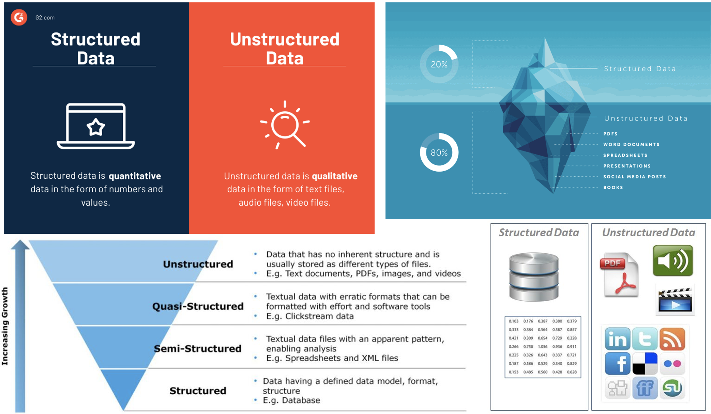
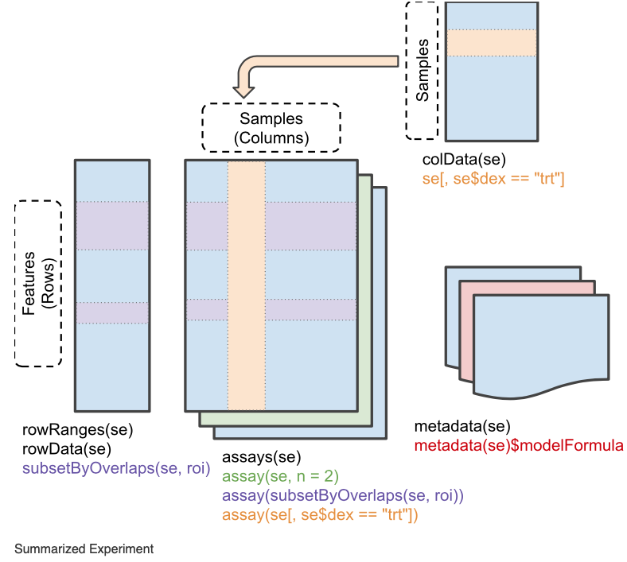
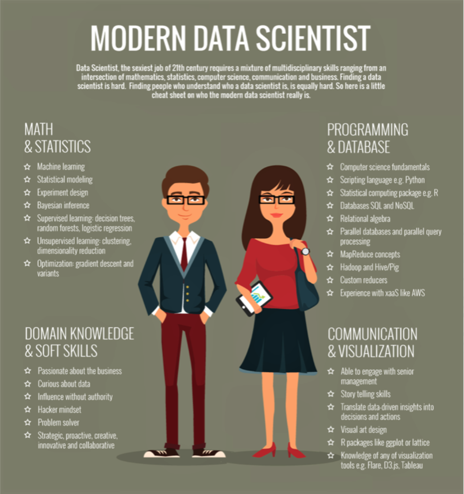
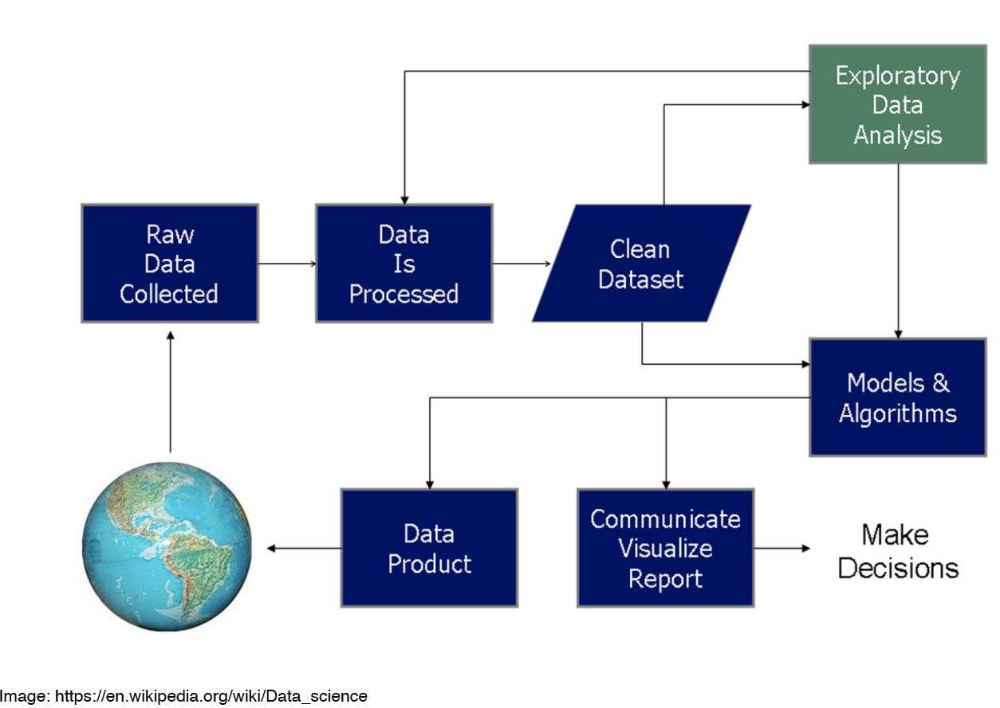
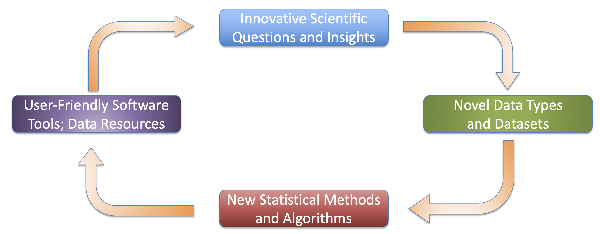
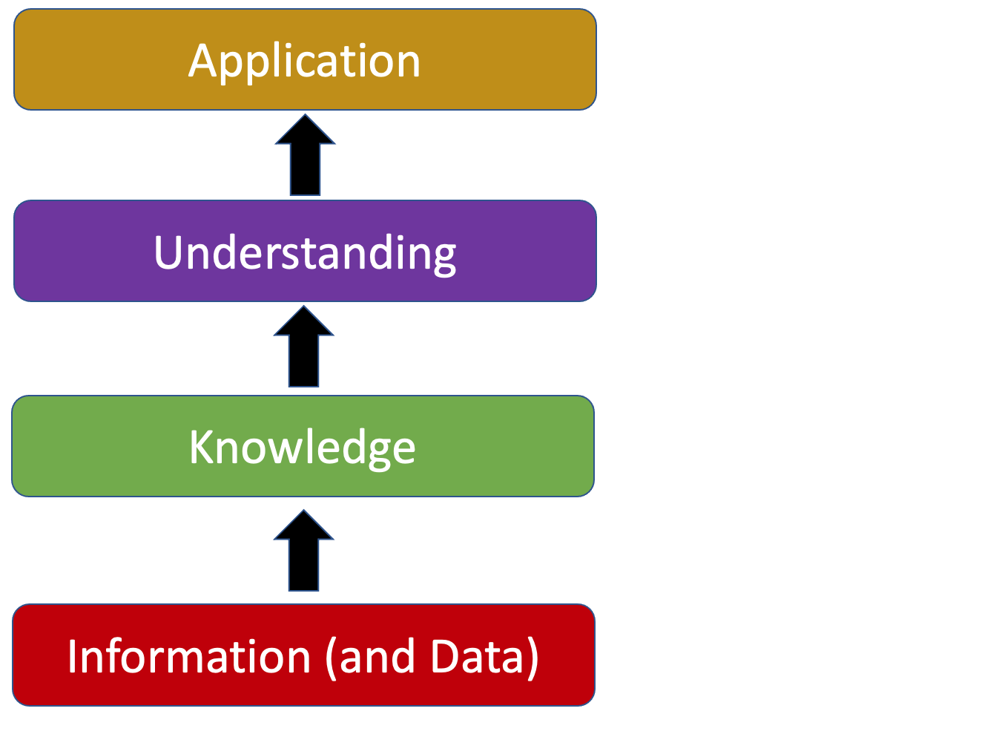
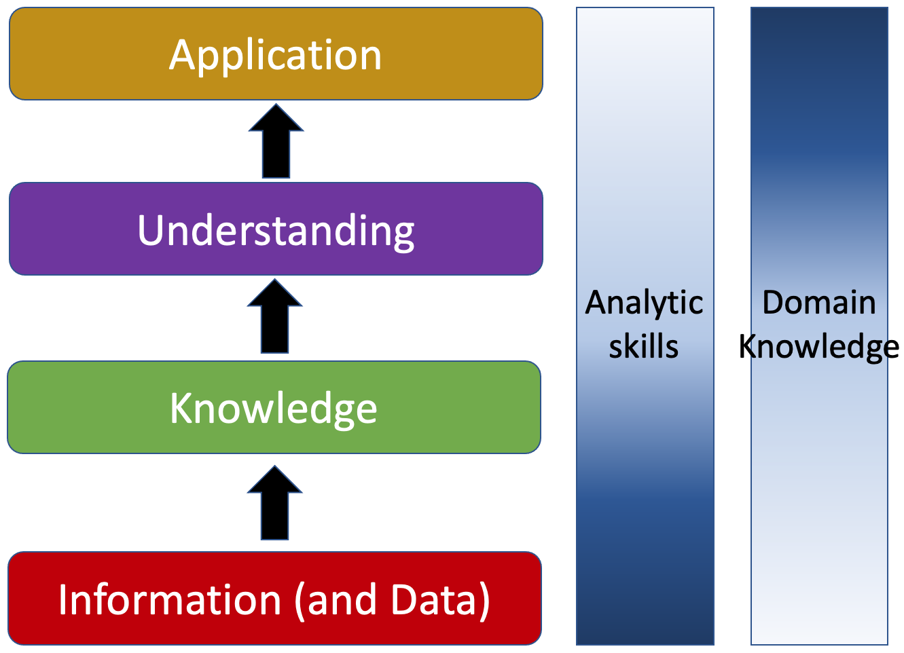
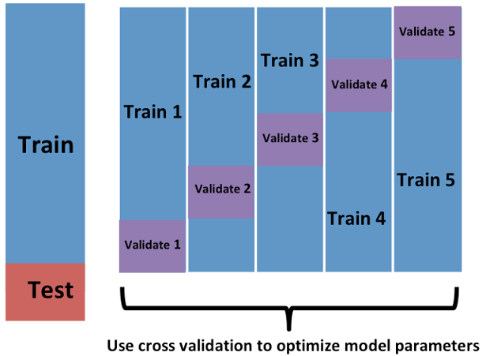
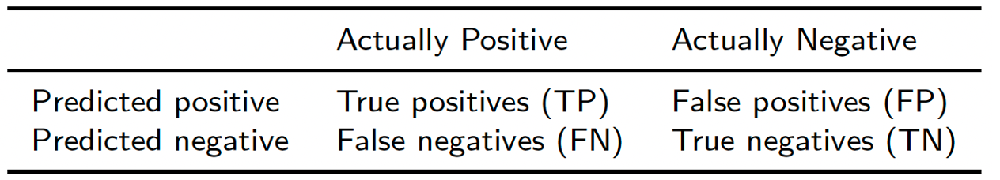

```{r setup, include=FALSE}
knitr::opts_chunk$set(echo = TRUE, fig.align="center")
img_path <- "figs/"
```


## Things you should know about MLBD
\Large
* [Click here for the Zoom link](https://rutgers.zoom.us/j/95676644246?pwd=coPLXHRNqrf8akL5k5mSl19CDIBoiW.1)
* GitHub vs Canvas:
    + [https://github.com/wevanjohnson/2025_Fall_MLBD](https://github.com/wevanjohnson/2025_Fall_MLBD)
* [Link to Syllabus](https://github.com/wevanjohnson/2025_Fall_MLBD/raw/refs/heads/main/MachineLearning_Syllabus.docx)
* Background experience
  * Introductory statistics and molecular biology
* Prerequisites (Machine Learning for Biomedical Data)
  * Basic Unix scripting
  * Amarel access and experience (ondemand, submissions)
  * Basic R programming: tidyverse, ggplot2, R Markdown
  * Working knowledge of git and GitHub


# Introduction to Machine Learning and Data Science 

##
\center
{height="70%"}

Big Data has fundamentally changed how we look at science and business. Along with advances in analytic methods, they are providing unparalleled insights into our physical world and society

## Structured vs. Unstructured data
\center
{height="70%"}


## Structured vs. Unstructured data
\center
{height="70%"}

## Data Science Revolution
\begin{columns}
	\begin{column}{0.5\textwidth}
	\includegraphics[width=2.5in]{figs/ds_venn.png}
	\end{column}
	
	\begin{column}{0.5\textwidth}
{
	\begin{itemize}
	\item Few have all the skills	
	\item Flexibility in area (business, strategy, health care) and conditions
	\item Data science makes companies and data better! 
	\end{itemize}
}
	\end{column}
\end{columns}

##
\center


## Data Science Process
\center
{height="70%"}

## Scientific Cycle for Data Science
Johnson Lab Approach to Science:
\center
{height="90%"}


# Keeping the "Science" in Data Science

## Domain Knowledge

**Domain knowledge** is knowledge of a specific, specialized discipline or field, in contrast to general (or domain-independent) knowledge. For example, in describing a software engineer may have general knowledge of computer programming as well as domain knowledge about developing programs for a particular industry. People with domain knowledge are often regarded as specialists or experts in their field. (Wikipedia!)

## Analytics Hierarchy
\center
{height="70%"}


## Analytics Hierarchy
\center
{height="70%"}

## Formal definitions
\Large
**Machine learning** is a computer’s way of learning from examples, and it is one of the most useful tools we have for the construction of _artificially intelligent_ systems

**Artificial intelligence** is a term used when machines (or computers) can mimic functions that humans can do.

  - Example: Learning and problem solving

## Formal definitions
\Large
An **Algorithm** is a sequence of actions that are “self-contained”

* Effective method for calculation
  + Finite steps/instructions
  + When applied, it produces a correct answer
  + The instructions need to be followed
  + In principle, it can be done by a “human”

## Formal definitions
\Large
A **Computer Algorithm** is a sequence of actions that are “self-contained”

* Effective method for calculation
  + Finite steps/instructions
  + When applied, it produces a correct answer
  + The instructions need to be followed
  + In principle, it can be done by a “computer”

## Formal definitions
\Large
* Computer Code:
  + Human readable text
  + Fully executable description of a software system

* What’s in the data?
  + Datum: “(thing) given”
  + Data is useful only when it has been analyzed

## Supervised vs unsupervised learning
\Large
Machine learning algorithms are generally classified into two categories:

1. **Supervised:** Outcomes used to create the predictor, e.g., classification.
2. **Unsupervised:** Don't know outcomes, rather interestedin discovering groups, e.g., clustering.

## Formal definitions
\Large
**Training and Test sets:** We usually split our dataset into two parts, one for model creation (train) and one for validation (test)

## Formal definitions
\Large
**Training and Test sets:** We usually split our dataset into two parts, one for model creation (train) and one for validation (test)

**Cross-validation:** Iterative retraining of the predictor on multiple partitions of training set
\center
{height=40%}

## Formal definitions
\Large
**Confusion matrix:** tabulates each combination of predicted and actual values:


**Overfitting:** Dangerously over-optimistic assessments---this is a _big problem_ in machine learning

## The caret package in R
\Large
The `caret` package in R has several useful functions for building and assessing machine learning methods.

- _Examples:_

## Regularization in Machine Learning
\Large
In regression analysis, the features are estimated using coefficients while modeling. In small sample sizes or noisy data coefficient estimates could be anecdotally incorrect (e.g., overfitting) or innacurate.  

If the estimates can be restricted, penalized, or shrunk towards zero, then the impact of insignificant features might be reduced and would prevent models from high variance with a stable fit.\footnote{Adapted from: https://www.analyticssteps.com/blogs/l2-and-l1-regularization-machine-learning}

## Regularization in Machine Learning
\Large
**Regularization** is the most used technique to penalize complex models in machine learning, it is deployed for reducing overfitting (or, contracting generalization errors) by putting small network weights into the model (adding a small amount of biad). Also, it enhances the performance of models for new inputs.\footnote{Source: https://www.analyticssteps.com/blogs/l2-and-l1-regularization-machine-learning}

## Regularization in Machine Learning
\Large
Examples of regularization in machine learning, include:

* Regression: Penalizing coefficients to create parsimonious models (variable selection)
* K-means: Restricting the segments for avoiding redundant groups.
* Neural networks: Confining the complexity (weights) of a model.
* Random forests: Reducing the depths of tree and branches (new features)


## Kernel-based machine learning
\Large
**Kernel machines** are a class of methods for pattern analysis that use linear classifiers to solve nonlinear problems. 

Kernel methods only require a user-specified kernel, i.e., a similarity function over all pairs of data points computed using inner products.

In contrast, many other algorithms require the explicit transformation of the raw data.

## Kernel based machine learning
\Large
Algorithms that operate with kernels include:

* Kernel perceptron
* Support-vector machines (SVM)
* Gaussian processes
* Principal components analysis (PCA)
* Canonical correlation analysis
* Ridge regression
* Spectral clustering
* Linear adaptive filters


## Session info
\tiny
```{r session info}
sessionInfo()
```

