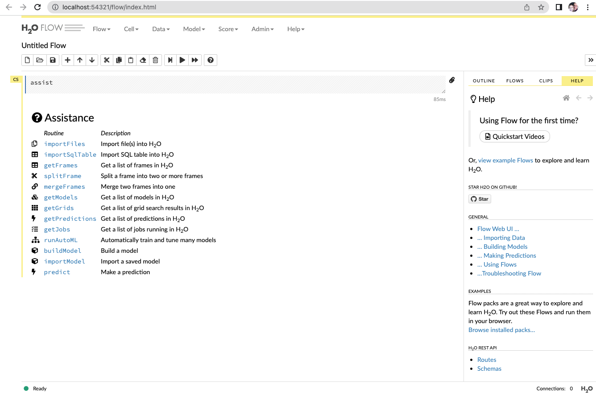

```{r setup, include=FALSE}
knitr::opts_chunk$set(echo = TRUE, fig.align="center")
library(caret)
library(tidyverse)
img_path <- "amlFigs/"
```


## Describing H2O
\Large
There is a lot of buzz for machine learning algorithms as well as a requirement for its experts. We all know that there is a significant gap in the skill requirement. The motive of H2O is to provide a platform which made easy for the non-experts to do experiments with machine learning.

## Describing H2O
\Large
H2O’s core code is written in Java that enables the whole framework for multi-threading. Although it is written in Java, it provides interfaces for R, Python and others, thus enabling it to be used efficiently.

In short, we can say that H2O is an open source, in memory, distributed, fast and scalable machine learning and predictive analytics toolkit that facilitates the building and application of machine learning models.


## Using H2O
\tiny
```{r}
# install.packages("h2o")
library(h2o)
```

## Using H2O
\scriptsize
```{r}
h2o.init()
```

## Using H2O
\Large
**Note:** Initializing H2O might throw an error in your system in the case where you don’t have Jdk of 64 bit. If such issue arises, please [install latest Jdk of 64 bits here](https://java.com/en/download/), it should work without issue afterward.

## Using H2O
\Large
The h2o.init() command is pretty smart and does a lot of work. At first, it looks for any active H2O instance before starting a new one and then starts a new one when instance are not present.

## Using H2O
\Large
It does have arguments which helps to accommodate resources to the H2O instance frequently used are:

* **nthreads:** By default, the value of nthreads will be -1 which means the instance can use all the cores of the CPU, we can set the number of cores utilized by passing the value to the argument.
* **max_mem_size:** By passing a value to this argument you can restrict the maximum memory allocated to the instance. Its od string type can pass an argument as ‘2g’ or ‘2G’ for 2 GBs of memory, same when you want to allocate in MBs.

## Using H2O
\Large
You can access the flow by typing [http://localhost:54321](http://localhost:54321) in your browser. 

## Using H2O
\Large
Flow is the name of the web interface that is part of H2O which does not require any extra installations which is written in CoffeeScript (a JavaScript like language). You can use it for doing the following things:

* Upload data directly
* View data uploaded by the client
* Create models directly
* View models created by you or your client
* view predictions
* Run predictions directly

## 


## H2O AutoML
\Large
**AutoML** helps in automatic training and tuning of many models within a user-specified time limit.

The current version of AutoML function can train and cross-validate a Random Forest, an Extremely-Randomized Forest, a random grid of Gradient Boosting Machines (GBMs), a random grid of Deep Neural Nets, and then trains a Stacked Ensemble using all of the models.

## H2O AutoML
\Large
When we say AutoML, it should cater to the aspects of data preparation, Model generation, and Ensembles and also provide few parameters as possible so that users can perform tasks with little confusion. 

AutoML inputs required arguments **y** and the **training_frame**, with the **x** and **validation frame** as optional arguments. The user can also configure values for **max_runtime_sec** and **max_models**.

## H2O AutoML
\Large
Additional optional parameters include:

* leaderboard_frame
* nfolds
* fold_columns
* weights_column
* ignored_columns
* stopping_metric
* sort_metric

## H2O Kmeans on the iris data
```{r}
iris_h2o <- as.h2o(iris)
iris_h2o['Species'] <- as.factor(iris_h2o['Species'])
predictors <- colnames(iris_h2o)[-length(iris_h2o)]

iris_splits <- h2o.splitFrame(data = iris_h2o, 
                              ratios = 0.7, seed = 1234)
train <- iris_splits[[1]]
valid <- iris_splits[[2]]
```

## H2O Kmeans on the iris data

```{r}
kmeans_model <- h2o.kmeans(training_frame = train, 
                           x = predictors, k = 3,
                           seed = 1)
centers <- h2o.centers(kmeans_model)
centers
```

## H2O Kmeans on the iris data
```{r, out.width='40%'}
iris %>% ggplot(aes(Sepal.Length,Petal.Length)) +
  geom_point(aes(col=Species), size=5) + 
  geom_point(aes(sepallength,petallength), 
            col=1, size=10, pch = 4, data=centers)
```


## H2O AutoML on the iris data
\tiny
```{r, eval=T, echo=T}
iris_automl <- h2o.automl(x = predictors, y = "Species", 
                          training_frame = train, 
                          max_runtime_secs = 20, seed = 1,
                          validation_frame = valid)
iris_automl
```

## H2O AutoML on the iris data
\scriptsize
```{r, eval=T}
lb <- h2o.get_leaderboard(iris_automl)
head(lb)
```

## H2O AutoML on the iris data
\tiny
```{r, eval=T}
iris_automl@leader
```

## H2O AutoML on the iris data
\tiny
```{r, eval=T, out.width="40%"}
h2o.varimp(iris_automl@leader)
h2o.varimp_plot(iris_automl@leader)
```

## H2O AutoML on the iris data
\scriptsize
```{r, eval=T}
pred <- h2o.predict(iris_automl@leader, valid)
pred
```


## H2O AutoML on the prostate cancer dataset
\tiny
```{r}
prostate_path <- system.file("extdata", "prostate.csv", 
                             package = "h2o")
prostate <- h2o.importFile(path = prostate_path, header = TRUE)
y <- "CAPSULE"
prostate[,y] <- as.factor(prostate[,y])  
knitr::kable(prostate)
```

## H2O AutoML on the prostate cancer dataset
\tiny
```{r, eval=T}
aml <- h2o.automl(y = y, training_frame = prostate,
                  max_runtime_secs = 20, seed = 1)
lb <- h2o.get_leaderboard(aml)
head(lb)
```

## Session Info
\tiny
```{r session}
sessionInfo()
```
