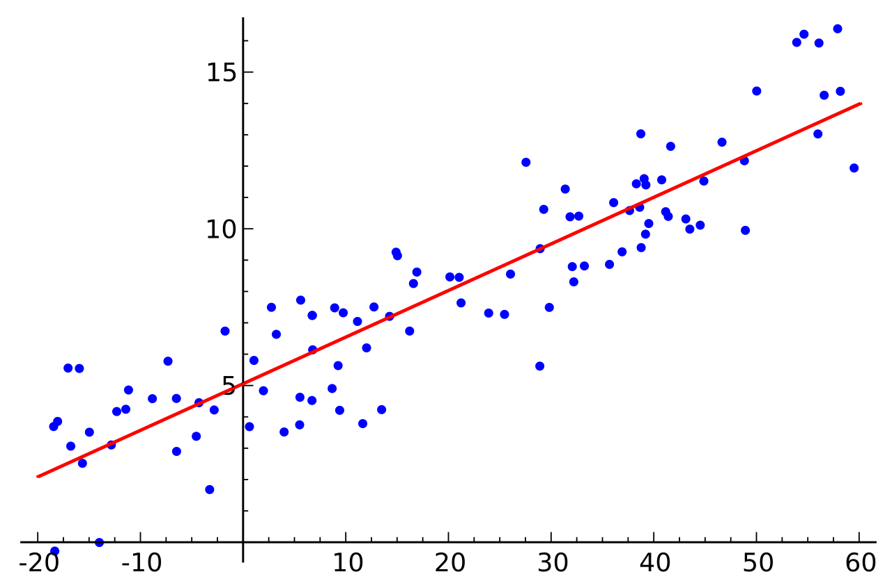
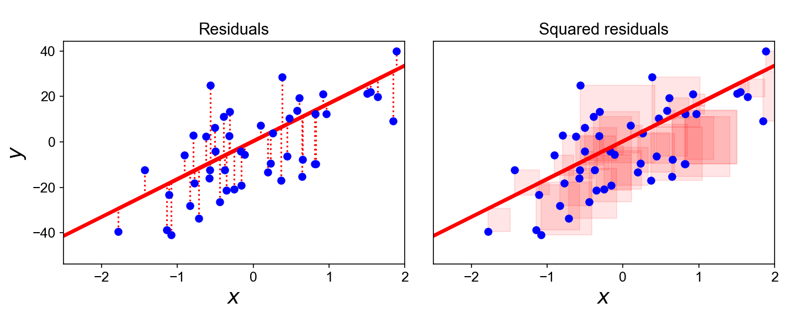
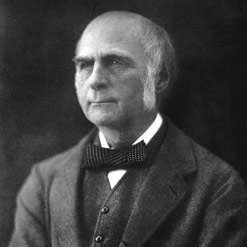
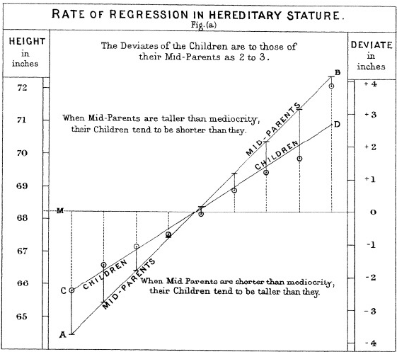

```{r setup, include=FALSE}
knitr::opts_chunk$set(echo = TRUE, warning = F)
img_path <- "regfigs/"
```

## Introduction to Regression
\Large
In data science applications, it is very common to be interested in the relationship between two or more variables. For example, we we might want to use a data-driven approach that examines the relationship between baseball player statistics and success to guide the building of a baseball team with a limited budget.  Before delving into this more complex example, we introduce necessary concepts needed to understand regression. 

## Introduction to Regression
\Large
In statistical modeling, regression analysis is a set of statistical processes for estimating the relationships between a dependent variable (often called the 'outcome' or 'response' variable, or a 'label' in machine learning parlance) and one or more independent variables (often called 'predictors', 'covariates', 'explanatory variables' or 'features'). 

## Introduction to Regression
\Large
The most common form of regression analysis is **linear regression**, in which one finds the line (or a more complex linear combination) that most closely fits the data according to a specific mathematical criterion.

## Introduction to Regression
\Large
In your math classes, you used the following model for a line, where $m$ represents the slope and $b$ represents the $y$-intercept: 
$$y=mx+b.$$

In statistics, we use a slightly different formulation and notation: 
$$y_i=\beta_0+x_i\beta_1 ,$$
which describes a line with slope $\beta_1$ and $y$-intercept $\beta_0$, and the $y_i$ and $x_i$ represent the observed points from your dataset. 

## Introduction to Regression
\Large
One other important difference between your math class and statistics is that in math you are usually fitting lines that fit your points _exactly_, whereas in statistics your points usually _do not_ fall on directly on your line. 

In statistics, we are attempting to find the __best fit__ line that uses your data to estimate the unobserved relationship (slope and intercept) between the independent and dependent variables. As defined above, this relationship between parameters $\beta_0$ and $\beta_1$ and the data points is called a **linear regression model**. 

## Introduction to Regression
\center
{height='70%'}


## Introduction to Regression
\Large
Formal Definition: suppose we observe $n$ data pairs and call them 
$${(x_i, y_i), i = 1, ..., n}.$$ 

We can describe the underlying relationship between $y_i$ and $x_i$ involving this error term $\epsilon_i$ by
$$y_i=\beta_0+x_i\beta_1 +\epsilon_i.$$

We call the deviations of the data from the line the **errors**. It is also important to note that the true underlying parameters $\beta_0$ and $\beta_1$ are not observed, but must be _estimated_ using the data.


## Introduction to Regression
\Large
The goal is to find estimated values $\hat\beta_0$ and $\hat\beta_1$ for the parameters $\beta_0$ and $\beta_1$ which would provide the "best fit" in some sense for the data points. 

Here, the "best fit" will be understood as in the __least-squares__ approach: a line that minimizes the sum of squared residuals 
$$\min_{\beta_0,\beta_1}Q(\beta_0,\beta_1) =  \underset{\beta_0,\beta_1}\inf\left\{\sum_{i=1}^n(y_i-\beta_0-x_i\beta_1)^2\right\}=\inf_{\beta_0,\beta_1}\sum_{i=1}^n \epsilon_i^2.$$

## Introduction to Regression
\Large
The least squares estimator (LSE) is the most commonly used method due to its favorable mathematical properties (not shown here). For example, it can be mathematically shown that the LSE is the _minimum variance unbiased linear estimator_--meaning that no unbiased estimator can have a smaller (sampling distrbution) variance for $\hat\beta_0$ and $\hat\beta_1$.  

## Introduction to regression


## Case study: is height hereditary?
\Large
History of regression: Francis Galton^[https://en.wikipedia.org/wiki/Francis_Galton] studied the variation and heredity of human traits, including height data from families to try to understand heredity. While doing this, he developed the concepts of correlation and regression, as well as a connection to pairs of data that follow a normal distribution. 

\center
{ width=20% }


## Case study: is height hereditary?
\Large
A very specific question Galton tried to answer was: how well can we predict a child's height based on the parents' height? The technique he developed to answer this question was called **regression**!  

__Historical note__: Galton made important contributions to statistics and genetics, but he was also a proponent of eugenics, a scientifically flawed philosophical movement with horrific historical consequences: [https://pged.org/history-eugenics-and-genetics/](https://pged.org/history-eugenics-and-genetics/).

## Case study: is height hereditary?
\Large
Galton's height data is in the `HistData` package. We will create a dataset with the heights of fathers and a randomly selected son: 

\footnotesize
```{r, message=FALSE, warning=FALSE, echo=TRUE}
library(tidyverse)
library(HistData)
data("GaltonFamilies")

set.seed(1983)
galton_heights <- GaltonFamilies %>%
  filter(gender == "male") %>%
  group_by(family) %>%
  sample_n(1) %>%
  ungroup() %>%
  select(father, childHeight) %>%
  rename(son = childHeight)
```

## Case study: is height hereditary?

Suppose we were asked to summarize the father and son data. Since both distributions are well approximated by the normal distribution, we could use the two averages and two standard deviations as summaries:
\small
```{r, echo=TRUE}
galton_heights %>% 
  summarize(mean(father), sd(father), mean(son), sd(son))
```

However, this summary fails to describe an important characteristic of the data: the trend that the taller the father, the taller the son. 

## Case study: is height hereditary?

```{r scatterplot, fig.height = 3, fig.width = 3, out.width="40%", echo=TRUE, fig.align="center"}
galton_heights %>% ggplot(aes(father, son)) + 
  geom_point(alpha = 0.5)
```


## Case study: is height hereditary?
\Large
The correlation between father and son's heights is:

```{r}
galton_heights %>% 
    summarize(r = cor(father, son)) %>% 
    pull(r)
```

## Case study: is height hereditary?

In R, we can obtain the least squares estimates using the `lm` function. To fit the model:
$$
y_i = \beta_0 + x_i \beta_1 + \varepsilon_i
$$

with $y_i$ the son's height and $x_i$ the father's height, we can use this code to obtain the least squares estimates: 
```{r, echo=TRUE}
fit <- lm(son ~ father, data = galton_heights)
fit$coef
```

## Case study: is height hereditary?
The object `fit` includes more information about the fit. We can use the function `summary` to extract more of this information:
\scriptsize
```{r}
summary(fit)
```

## Case study: is height hereditary?
We can use `ggplot2` layers to plot $\hat{Y}$ with its confidence intervals:
\small
```{r father-son-regression, fig.height = 3, fig.width = 3, out.width="40%", fig.align="center",message=FALSE}
galton_heights %>% ggplot(aes(father, son)) +
  geom_point() + geom_smooth(method = "lm")
```

## Case study: is height hereditary?
\Large
The R function `predict` takes an `lm` object as input and returns the prediction. If requested, the standard errors and other information from which we can construct confidence intervals is provided:

\scriptsize
```{r father-son-predictor}
fit <- galton_heights %>% lm(son ~ father, data = .) 
y_hat <- fit %>% predict(se.fit = TRUE)
names(y_hat)
```


## Introduction to Regression
\Large
Now, we can extend our regression to include multiple ($p$) predictors: 
$$y_i=x_{i1}\beta_1+\ldots+x_{ip}\beta_p+\epsilon_i=\sum_{j=1}^{p}x_{ij}\beta_j+\epsilon_i.$$

Note that this model can still include a $y$-intercept if one of your predictors is a constant for all $x,y$ data pairs, e.g., $x_{ij}={1}$ for all $i$ for a particular $j$. In this case, $x_{ij}\beta_j=(1)\beta_j=\beta_0$.

## Introduction to Regression
Fitting the entire dataset using **multiple regression**:
\tiny
```{r, message=FALSE, warning=FALSE, echo=TRUE}
fit2 <- GaltonFamilies %>% 
  lm(childHeight ~ mother + father + gender + children, data = .)
fit2 %>% summary()
```

## Introduction to Regression
Interpreting this model: 

* The intercept, $\beta_0$ = 17.4 inches (p-value=`5.08e-10`). 
* Every inch increase in mother's height leads to a $\beta_{mother}$ = 0.32 (p-value<`2e-16`) in `childHeight`.
* Every inch increase in father's height leads to a $\beta_{father}$ = 0.39 (p-value<`2e-16`) in `childHeight`.
* `Gender=female` was selected as the reference level, and `gender=male` results in an increase in $\beta_{male}=5.2$ inches (p-value`<2e-16`). _R always chooses the first level of a factor (alphabetically) as the reference._ 
* The number of children $\beta_{children}$ is not a significant predictor of child height (p-value=0.0825).
* Multiple $R^2=0.637$ and adjusted $R^2=0.635$, thus `father`, `mother`, and `gender` are moderately strong predictors of `childHeight`.

## Introduction to Regression
\Large
In addition, we can use matrices to represent our model. Assume ${\bf y}=(y_1, y_2, \ldots, y_n)$ with a matrix of predictors ${\bf X}$ and coefficient vector $\beta$ ($n\times 1$ vector). Then we can define our regression equation as: $${\bf y}=X\beta+\epsilon,$$
where $\epsilon\sim N({\bf 0},\sigma^2 I_n)$ and $I_n$ is an identity matrix with dimension $n$.

## Introduction to Regression
\Large
Minimizing the least squared error is can be represented by
$$\hat\beta=\underset{\beta}\inf\left\{\sum_{i=1}^{n}(y_i-\sum_{j=1}^{p}x_{ij}\beta_j)^2\right\}=\underset{\beta}\inf\left\{({\bf y}-{\bf X}\beta)'({\bf y}-{\bf X}\beta)\right\}$$

## Diversion: Maximum Likelihood for a Normal mean
\Large
Assume ${\bf x}=(x_1, x_2, \ldots, x_N)$, where $x_i$s are independent from a Normal($\mu,\sigma^2$) distribution, where ${\bf x}$ is observed and $\sigma^2$ is known. Then 
$$L(\mu|{\bf x})=\left\{\frac{1}{2\pi\sigma^2}\right\}^{N/2}exp\left\{-\frac{1}{2\sigma^2}\sum_{i=1}^{N}(x_i-\mu)^2\right\}$$\pause
Notice we can maximize $L(\mu|{\bf x})$ by minimizing $\sum_{i=1}^{N}(x_i-\mu)^2$ for $\mu$.

## Diversion: Maximum Likelihood for a Normal mean
\Large
Note the following:
\[
\begin{aligned}
\sum_{i=1}^{N}(x_i-\mu)^2 &= \sum_{i=1}^{N}(x_i^2-2\mu x_i+\mu^2)\\\pause
  &= \sum_{i=1}^{N}x_i^2-2\mu\sum_{i=1}^{N}x_i+N\mu^2\\\pause
\end{aligned}
\]

## Diversion: Maximum Likelihood for a Normal mean
therefore:
\[
\begin{aligned}
\frac{\partial}{\partial\mu} &=-2\sum x_i+2N\hat\mu\stackrel{set}{=}0\\\pause
  &\Rightarrow N\hat\mu = \sum x_i\\\pause
  &\Rightarrow \hat\mu = \frac{\sum x_i}{N}
\end{aligned}
\]


## Diversion: Maximum Likelihood for Regression
\Large
Assume ${\bf y}=(y_1, y_2, \ldots, y_N)$ with a matrix of predictors ${\bf X}$ and coefficient vector $\beta$ ($n\times 1$ vector). Then we can define our regression equation as: $${\bf y}=X\beta+\epsilon,$$
where $\epsilon\sim N({\bf 0},\sigma^2 I_N)$ and $I_N$ is an identity matrix with dimension $N$.

## Diversion: Maximum Likelihood for Regression
\Large
Now, extending the Normal mean MLE to regression, we note that $$\sum_{i=1}^{N}(y_i-x_1\beta_1-\ldots-x_N\beta_N)^2=({\bf y}-{\bf X}\beta)'({\bf y}-{\bf X}\beta),$$\pause
so
$$L(\beta|{\bf X},{\bf y})=\left\{\frac{1}{2\pi\sigma^2}\right\}^{N/2}exp\left\{-\frac{1}{2\sigma^2}({\bf y}-{\bf X}\beta)'({\bf y}-{\bf X}\beta)\right\}.$$
Thus maximizing the Likelihood is equivalent to minimizing $({\bf y}-{\bf X}\beta)'({\bf y}-{\bf X}\beta)$, or in other words, minimizing the sum of the squared error!

## Diversion: Maximum Likelihood for Regression
\Large
Note 
$$({\bf y}-{\bf X}\beta)'({\bf y}-{\bf X}\beta)={\bf y}'{\bf y}-2\beta'{\bf X}'{\bf y}+\beta'{\bf X}'{\bf X}\beta,$$\pause
and therefore
\[
\begin{aligned}
\frac{\partial}{\partial\beta} &=-2{\bf X}'{\bf y}+2{\bf X}'{\bf X}\hat\beta \stackrel{set}{=}0\\\pause
  &\Rightarrow {\bf X'X}\hat\beta = {\bf X'y}\\\pause
  &\Rightarrow {\bf (X'X)}^{-1}{\bf X'X}\hat\beta = {\bf (X'X)}^{-1}{\bf X'y}\\\pause
  &\Rightarrow \hat\beta = {\bf (X'X)}^{-1}{\bf X'y}
\end{aligned}
\]

## Diversion: Maximum Likelihood for Regression
\Large
Now note: 
\[
\begin{aligned}
E[\hat\beta] &= E[{\bf (X'X)}^{-1}{\bf X'y}] \\\pause
  &= {\bf (X'X)}^{-1}{\bf X'}E[{\bf y}]\\\pause
  &= {\bf (X'X)}^{-1}{\bf X'X\beta}\\\pause
  &= \beta
\end{aligned}
\]

## Diversion: Maximum Likelihood for Regression
\Large
And, remembering that $$Var[{\bf Ay}]={\bf A}\{Var[{\bf y}]\}{\bf A'},$$ 
so therefore,
\[
\begin{aligned}
Var[\hat\beta] &= Var[{\bf (X'X)}^{-1}{\bf X'y}] \\\pause
  &= {\bf (X'X)}^{-1}{\bf X'}\{Var[{\bf y}]\}{\bf X}{\bf (X'X)}^{-1}\\\pause
  &= {\bf (X'X)}^{-1}{\bf X'}\{\sigma^2 I_N\}{\bf X}{\bf (X'X)}^{-1}\\\pause
  &= \sigma^2{\bf (X'X)}^{-1}{\bf X'X}{\bf (X'X)}^{-1}\\\pause
  &= \sigma^2{\bf (X'X)}^{-1}.
\end{aligned}
\]

Typically, we use the following to estimate $\sigma^2$:
$$\hat\sigma^2=\frac{1}{N-p-1}({\bf y}-X{\bf\hat\beta})'({\bf y}-X{\bf\hat\beta})$$

## Diversion: Maximum Likelihood for Regression
\Large
So we can conduct a hypothesis test $\beta$, where $H_0: \beta_j=0$ versus $H_a: \beta_j \ne 0$ using the statistic: 

$$t_{\beta_j} = \frac{\hat\beta_j}{\hat\sigma\sqrt{v_{jj}}},$$ 
where $v_{jj}$ is the $j$th diagonal element of ${\bf V={\bf (X'X)}^{-1}}$. Under $H_0$, $t_{\beta_j}$ will follow a $t$ distribution with $N-p-1$ degrees of freedom.


<!--
## Case study: is height hereditary?
\center
 
-->


## Case study: is height hereditary?
\Large
Thus using our estimator for ${\bf\beta}$: <!-- and $\hat\sigma^2$: -->

$${\bf\hat\beta} = (X'X)^{-1}X'{\bf y}$$ <!--, Var({\bf\hat\beta})=\sigma^2(X'X)^{-1}, \mbox{ and }$$ --> <!--$$\hat\sigma^2=\frac{1}{N-p-1}({\bf y}-X{\bf\hat\beta})'({\bf y}-X{\bf\hat\beta})$$ -->
\normalsize
```{r}
X <- cbind(1,galton_heights$father)
y <- galton_heights$son
beta_hat <- solve(t(X)%*%X)%*%t(X)%*%y
beta_hat
```

## Case study: is height hereditary?
Predicted values can be obtained by: $\hat y = X\hat\beta$, In R: 
\scriptsize
```{r, ,fig.height = 3, fig.width = 3, out.width="30%", fig.align="center"}
y_hat <- X %*% beta_hat

galton_heights %>% ggplot(aes(father, son)) +
  geom_point(alpha = 0.5) +
  geom_point(aes(y = y_hat), col = "red") +
  geom_abline(slope = 1, intercept = 0)
```

## Case study: is height hereditary?
\center
{width=50%}


## Case study: is height hereditary?
For hypothesis testing we can optain a standard error: 
$$SE({\hat\beta_i})=\hat\sigma \sqrt{v_{ii}},$$ where $v_{ii}$ is the $i$th diagonal element of $(X'X)^{-1}$, and $$\hat\sigma^2=\frac{1}{N-p-1}({\bf y}-X{\bf\hat\beta})'({\bf y}-X{\bf\hat\beta})$$

```{r}
N <- length(y)
p <- length(beta_hat)
sigma2_hat <- 1 / (N - p - 1) * 
  t(y - X %*% beta_hat) %*% (y - X %*% beta_hat)
V <- solve(t(X) %*% X)
Z2 <- beta_hat[2] / sqrt(sigma2_hat * V[2, 2])
Z2
```


## The Regression Fallacy
\Large

Wikipedia defines the _sophomore slump_ as: \vskip .2in

> A sophomore slump or sophomore jinx or sophomore jitters refers to an instance in which a second, or sophomore, effort fails to live up to the standards of the first effort. It is commonly used to refer to the apathy of students (second year of high school, college or university), the performance of athletes (second season of play), singers/bands (second album), television shows (second seasons) and movies (sequels/prequels).

## The Regression Fallacy
\Large
In Major League Baseball, the rookie of the year (ROY) award is given to the first-year player who is judged to have performed the best. The _sophmore slump_ phrase is used to describe the observation that ROY award winners don't do as well during their second year. For example, this Fox Sports article^[http://www.foxsports.com/mlb/story/kris-bryant-carlos-correa-rookies-of-year-award-matt-duffy-francisco-lindor-kang-sano-120715] asks "Will MLB's tremendous rookie class of 2015 suffer a sophomore slump?".

## The Regression Fallacy
\Large
Does the data confirm the existence of a sophomore slump? Let's take a look. Examining the data for batting average, we see that this observation holds true for the top performing ROYs:

<!--The data is available in the Lahman library, but we have to do some work to create a table with the statistics for all the ROY. First we create a table with player ID, their names, and their most played position.-->

```{r, echo=FALSE, message=FALSE, warning=FALSE}
library(tidyverse)
library(Lahman)
playerInfo <- Fielding %>% 
  group_by(playerID) %>% 
  arrange(desc(G)) %>%
  slice(1) %>%
  ungroup %>% 
  left_join(People, by="playerID") %>% 
  select(playerID, nameFirst, nameLast, POS)
```


<!--
Now, we will create a table with only the ROY award winners and add their batting statistics. We filter out pitchers, since pitchers are not given awards for batting and we are going to focus on offense. Specifically, we will focus on batting average since it is the summary that most pundits talk about when discussing the sophomore slump:
-->

```{r, echo=FALSE}
ROY <- AwardsPlayers %>%
  filter(awardID == "Rookie of the Year") %>% 
  left_join(playerInfo, by="playerID") %>%
  rename(rookie_year = yearID) %>%
  right_join(Batting, by="playerID") %>% 
  mutate(AVG = H/AB) %>% 
  filter(POS != "P")
```

<!--
We also will keep only the rookie and sophomore seasons and remove players that did not play sophomore seasons:
-->
```{r, echo=FALSE}
ROY <- ROY %>%  
  filter(yearID == rookie_year | yearID == rookie_year+1) %>% 
  group_by(playerID) %>% 
  mutate(rookie = ifelse(yearID == min(yearID), "rookie", "sophomore")) %>%
  filter(n() == 2) %>% 
  ungroup %>%
  select(playerID, rookie_year, rookie, nameFirst, nameLast, AVG) 
```

<!--
Finally, we will use the `spread` function to have one column for the rookie and sophomore years batting averages:
-->

```{r, echo=FALSE}
ROY <- ROY %>% spread(rookie, AVG) %>% arrange(desc(rookie)) 
tmp <- ROY %>% slice(1:5) %>%
  select(nameFirst, nameLast, rookie_year, rookie, sophomore)
if(knitr::is_html_output()){
  knitr::kable(tmp, "html") %>%
    kableExtra::kable_styling(bootstrap_options = "striped", 
                              full_width = FALSE)
} else{
  knitr::kable(tmp, "latex", booktabs = TRUE) %>%
    kableExtra::kable_styling(font_size = 8)
}
```

## The Regression Fallacy
\Large
In fact, the proportion of players that have a lower batting average their sophomore year is `r mean(ROY$sophomore - ROY$rookie <= 0)`.

o is it "jitters" or "jinx"? To answer this question, let's turn our attention to all players that played the 2013 and 2014 seasons and batted more than 130 times (minimum to win Rookie of the Year). 

<!--We perform similar operations to what we did above: -->

```{r, echo=FALSE , message=FALSE, warning=FALSE}
two_years <- Batting %>% 
  filter(yearID %in% 2013:2014) %>% 
  group_by(playerID, yearID) %>%  
  filter(sum(AB) >= 130) %>% 
  summarize(AVG = sum(H)/sum(AB)) %>% 
  ungroup %>% 
  spread(yearID, AVG) %>% 
  filter(!is.na(`2013`) & !is.na(`2014`)) %>%
  left_join(playerInfo, by="playerID") %>% 
  filter(POS!="P") %>% 
  select(-POS) %>%
  arrange(desc(`2013`)) %>% 
  select(nameFirst, nameLast, `2013`, `2014`)
```  

## The Regression Fallacy
\Large
The same pattern arises when we look at the top performers: batting averages go down for most of the top performers.

```{r, echo=FALSE}
tmp <- two_years %>% slice(1:5) 
if(knitr::is_html_output()){
  knitr::kable(tmp, "html") %>%
    kableExtra::kable_styling(bootstrap_options = "striped", full_width = FALSE)
} else{
  knitr::kable(tmp, "latex", booktabs = TRUE) %>%
    kableExtra::kable_styling(font_size = 8)
}
```
But these are not rookies! 

## The Regression Fallacy
\Large
Also, look at what happens to the worst performers of 2013:

```{r, echo=FALSE}
tmp <- arrange(two_years, `2013`) %>% slice(1:5)
if(knitr::is_html_output()){
  knitr::kable(tmp, "html") %>%
    kableExtra::kable_styling(bootstrap_options = "striped", full_width = FALSE)
} else{
  knitr::kable(tmp, "latex", booktabs = TRUE) %>%
    kableExtra::kable_styling(font_size = 8)
}
```

Their batting averages mostly go up! 

## The Regression Fallacy
\Large
Is this some sort of reverse sophomore slump? It is not. There is no such thing as the sophomore slump. This is all explained with a simple statistical fact: the correlation for performance in two separate years is high, but not perfect:

```{r regression-fallacy, echo=FALSE, fig.height=3, fig.width=3, out.width="30%", fig.align='center'}
qplot(`2013`, `2014`, data = two_years)
```

## The Regression Fallacy
\Large
The correlation is `r cor(two_years$"2013",two_years$"2014")` and
the data look very much like a bivariate normal distribution, which means we predict a 2014 batting average $Y$ for any given player that had a 2013 batting average $X$ with:

$$ \frac{Y - .255}{.032} = 0.46 \left( \frac{X - .261}{.023}\right) $$

## The Regression Fallacy
\Large
Because the correlation is not perfect, regression tells us that, on average, expect high performers from 2013 to do a bit worse in 2014. It's not a jinx; it's just due to chance. The ROY are selected from the top values of $X$ so it is expected that $Y$ will **regress to the mean**.


## Session Info
\tiny
```{r session}
sessionInfo()
```
