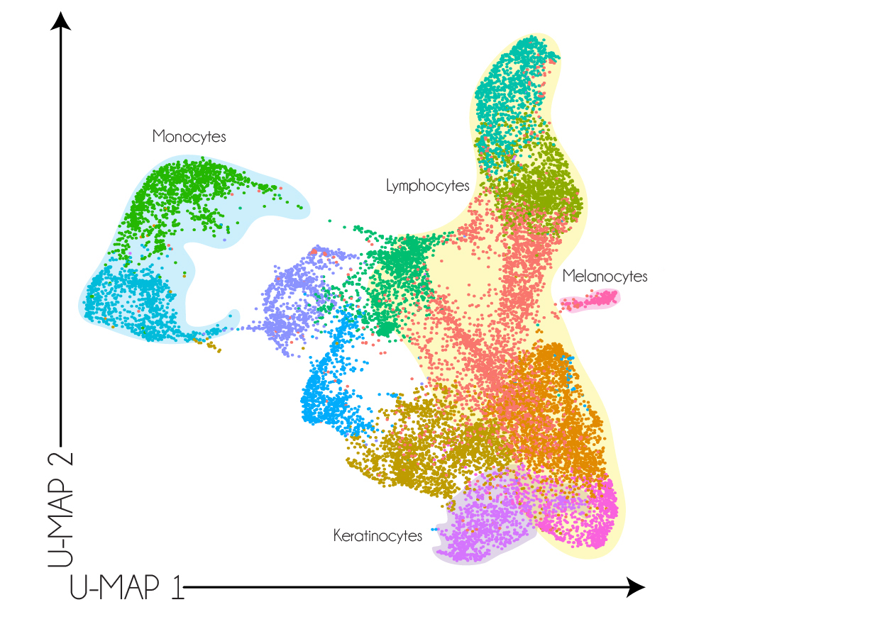

```{r setup, include=FALSE}
knitr::opts_chunk$set(echo = TRUE)
library(caret)
library(tidyverse)
img_path <- "cluster/"
```

## Supervised vs. Unsupervised Machine Learning
\Large
Machine learning algorithms are generally classified into two categories. In __Supervised__ machine learning we use the outcomes in a training set to __supervise__ the creation of our prediction algorithm. 

In __unsupervised__ machine we do not necessarily know the outcomes and instead are interested in discovering groups. These algorithms are also referred to as __clustering__ algorithms since predictors are used to define __clusters__. 


## Supervised vs. Unsupervised Machine Learning
Sometimes clustering is not be very useful. For example, if we are simply given the heights we may not be able to discover two groups, males and females. 

## Unsupervised Machine Learning
However, there are applications in which unsupervised learning can be a powerful technique, such as an exploratory tool: 
\center
{width=50%}

## Unsupervised Machine Learning
\Large
There are many algorithms for unsupervised learning. We have already learned about __PCA__ and __UMAP__ for dimension reduction. Here we introduce two methods for clustering: __hierarchical clustering__ and __k-means__.


## Unsupervised Machine Learning and clustering
\Large
A first step in any clustering algorithm is defining a distance between observations or groups of observations. 

__Hierarchical clustering__ starts by defining each observation as a separate group, and distances are calculated between every group (distance matrix). Then the two closest groups are merged into a single group, and this new group (two observations) is represented by its centroid. Distances between this new group and the rest are calculated, and then the next two closest groups are merged. This process is repeated until there is just one group.

## Hierarchical clustering
Consider the ratings of 50 movies from 139 different critics: 
\scriptsize
```{r}
library(dslabs); data("movielens")
top <- movielens %>% group_by(movieId) %>%
  summarize(n=n(), title = first(title)) %>%
  top_n(50, n) %>% pull(movieId)

x <- movielens %>%filter(movieId %in% top) %>%
  group_by(userId) %>% filter(n() >= 25) %>%
  ungroup() %>% select(title, userId, rating) %>%
  spread(userId, rating)

row_names <- str_remove(x$title, ": Episode") %>% str_trunc(20)
x <- x[,-1] %>% as.matrix()
x <- sweep(x, 2, colMeans(x, na.rm = TRUE))
x <- sweep(x, 1, rowMeans(x, na.rm = TRUE))
rownames(x) <- row_names
```

## Hierarchical clustering
\Large
We want to use these data to find out if there are clusters of movies based on the ratings from  `r ncol(x)` movie raters. A first step is to find the distance between each pair of movies using the `dist` function: 

```{r}
d <- dist(x)
```

## Hierarchical clustering
With the distance between each pair of movies computed, we need an algorithm to define groups from these. The `hclust` function implements this algorithm and it takes a distance as input.

```{r}
h <- hclust(d)
h
```

## Hierarchical clustering
We can see the resulting groups using a __dendrogram__. 

```{r dendrogram, out.width="100%", fig.width = 10, fig.height = 4.5, echo=FALSE}
rafalib::mypar()
plot(h, cex = 0.65, main = "", xlab = "")
```

## Hierarchical clustering
\Large
This graph gives us an approximation between the distance between any two movies. To find this distance we find the first location, from top to bottom, where these movies split into two different groups. The height of this location is the distance between these two groups. So, for example, the distance between the three _Star Wars_ movies is 8 or less, while the distance between _Raiders of the Lost of Ark_ and _Silence of the Lambs_ is about 17.

## Hierarchical clustering
To generate actual groups: 1) decide on a maximum  distance to be in the same group or 2) decide on the number of groups. For example:

```{r, echo=F, out.width="100%", fig.width = 10, fig.height = 4.5, echo=FALSE}
rafalib::mypar()
plot(h, cex = 0.65, main = "", xlab = "")
abline(h=14,col=2)
```

## Hierarchical clustering
\Large 
The function `cutree` can be applied to the output of `hclust` to perform either of these two operations and generate groups.
\normalsize
```{r}
# Maximum Distance
groups <- cutree(h, h = 14)
table(groups)
```


## Hierarchical clustering
\Large 
Or we can do fewer groups: 
\normalsize
```{r}
#Number of groups
groups <- cutree(h, k = 10)
table(groups)
```

## Hierarchical clustering
The clustering provides some insights, e.g., Group 4 appears to be blockbusters:

\scriptsize
```{r}
names(groups)[groups==4]
```

\normalsize
And group 9 appears to be fantasy/nerd movies:

\scriptsize
```{r}
names(groups)[groups==9]
```

## Hierarchical clustering
We can also explore the data to see if there are clusters of movie raters.

```{r dendrogram-2, , out.width="100%", fig.height=4, fig.width=10}
h_2 <- dist(t(x)) %>% hclust()
plot(h_2, cex = 0.35)
```


## K-Means
\Large
We can also use the k-means algorithm. Here, we have to pre-define $k$, the number of clusters we want to define. 

The k-means algorithm is iterative. The first step is to define $k$ centers. Then each observation is assigned to the cluster with the closest center to that observation. In a second step the centers are redefined using the observation in each cluster: the column means are used to define a __centroid__. We repeat these two steps until the centers converge.

## K-Means Clustering: The Objective Function
\Large
The goal of the k-means algorithm is to minimize the **Within-Cluster Sum of Squares (WCSS)**, also known as **Inertia** or the **quantization error**.

The WCSS is the sum of the squared Euclidean distances between each observation and its assigned cluster centroid.

$$
\min_{S} \sum_{k=1}^{K} \sum_{\mathbf{x}_i \in S_k} || \mathbf{x}_i - \boldsymbol{\mu}_k ||^2
$$

## K-Means Clustering: The Objective Function
\Large
Where:

* $K$ is the number of clusters.
* $S_k$ is the set of observations in cluster $k$.
* $\mathbf{x}_i$ is an observation vector.
* $\boldsymbol{\mu}_k$ is the centroid (mean) of cluster $S_k$.

The algorithm iteratively seeks to reduce this value.


## K-Means Clustering: Convergence
\Large
The standard k-means algorithm (Lloyd's algorithm) is an **iterative refinement technique** that alternates between two steps:

1.  **Assignment (Expectation) Step:** Assign each observation to the cluster whose centroid is the closest. This minimizes $|| \mathbf{x}_i - \boldsymbol{\mu}_k ||^2$ for a fixed $\boldsymbol{\mu}_k$.
2.  **Update (Maximization) Step:** Recalculate the centroids $\boldsymbol{\mu}_k$ as the mean of all observations assigned to cluster $k$. This minimizes the WCSS for fixed cluster assignments $S_k$.

## K-Means Clustering: Convergence
\Large
Each step strictly **decreases** the WCSS until the assignments or centroids no longer change. This property guarantees that the algorithm will **always converge** in a finite number of iterations.

##  K-Means Clustering: Local vs. Global Optimum
\Large
While the algorithm is guaranteed to converge, it is **not guaranteed to find the global minimum** of the WCSS objective function.

* The final solution is a **local minimum**, meaning any small change in the cluster assignments or centroids would increase the WCSS.
* The result is highly dependent on the **initial choice of the $K$ cluster centers**.


##  K-Means Clustering: Local vs. Global Optimum
\Large
* To address multiple convergence, we commonly run the algorithm multiple times (e.g., using `nstart` in R) with different random initializations and select the solution with the lowest final WCSS.
* Methods like **k-means++** (not used in base R's `kmeans` function) are designed to select better initial centroids to increase the chance of finding a good local minimum.


## K-Means
\Large
The `kmeans` function included in R-base does not handle NAs. For illustrative purposes we will fill out the NAs with 0s. In general, the choice of how to fill in missing data, or if one should do it at all, should be made with care.

```{r}
x_0 <- x; x_0[is.na(x_0)] <- 0
set.seed(0)
k <- kmeans(x_0, centers = 10)
```

## k-means
\Large
The cluster assignments are in the `cluster` component:

```{r}
groups <- k$cluster
table(groups)
```

## k-means
This yields some interesting groups:
\tiny
```{r}
names(groups)[groups==4]
names(groups)[groups==6]
names(groups)[groups==7]
names(groups)[groups==9]
names(groups)[groups==10]
```

## k-means
\Large
Note that because the first center is chosen at random, the final clusters are random. We impose some stability by repeating the entire function several times and averaging the results. The number of random starting values to use can be assigned through the `nstart` argument.

```{r}
k <- kmeans(x_0, centers = 10, nstart = 25)
```

---

## Other Unsupervised Clustering Methods
\Large
While hierarchical clustering and k-means are fundamental, many other powerful clustering algorithms exist.

\scriptsize
\begin{tabular}{|l|l|p{6cm}|}
\hline
\textbf{Algorithm} & \textbf{Method Class} & \textbf{Key Features} \\
\hline
\hline
\textbf{Mixture Modeling (GMM)} & Probabilistic/Model-Based & Assumes data is generated from a mixture of $K$ probability distributions (e.g., Gaussian). Provides \textbf{soft clustering}. Uses the \textbf{Expectation-Maximization (EM) algorithm}. \\
\hline
\textbf{DBSCAN} & Density-Based & Finds clusters of arbitrary shape based on \textbf{density}. Can identify \textbf{outliers} (noise). Does not require pre-specifying $K$. \\
\hline
\textbf{Louvain Method} & Graph/Community Detection & Highly efficient for finding \textbf{communities} in large \textbf{networks/graphs} by optimizing \textbf{modularity}. \\
\hline
\textbf{Affinity Propagation} & Affinity/Message Passing & Identifies "exemplars" as cluster centers. Does \textbf{not} require pre-specifying $K$. \\
\hline
\end{tabular}

## Community Detection: The Louvain Method
\Large
The Louvain method is an efficient algorithm for detecting **communities** (or clusters) in large **networks** or **graphs**. It's widely used in computational biology (e.g., single-cell analysis) and social network analysis.

Instead of minimizing WCSS like k-means, Louvain aims to maximize a metric called **modularity** ($\mathcal{Q}$).

\vspace{0.2in}
$$
\mathcal{Q} = \frac{1}{2m} \sum_{i,j} \left[ A_{ij} - \frac{k_i k_j}{2m} \right] \delta(c_i, c_j)
$$

## Community Detection: The Louvain Method
Where:

* $A_{ij}$ is the weight of the edge between nodes $i$ and $j$.
* $m$ is the total weight of all edges in the network.
* $k_i$ and $k_j$ are the sum of weights of edges attached to nodes $i$ and $j$ (their degrees).
* $\delta(c_i, c_j)$ is 1 if nodes $i$ and $j$ belong to the same community, and 0 otherwise.

\vspace{0.2in}
\textbf{Modularity} measures the strength of the division of a network into modules (or communities). A high modularity value indicates that communities have **dense internal connections** but **sparse connections** between them.


## Louvain Method: The Algorithm
\Large
The Louvain method is a **greedy optimization** algorithm that proceeds in two main phases, which are repeated iteratively until no further increase in modularity is possible:

## Louvain Method: The Algorithm
\Large
### Phase 1: Modularity Optimization
1.  Start with every node in the graph as its own **community**.
2.  For each node $i$, the algorithm considers moving it to all of its neighbors' communities.
3.  It calculates the **gain in modularity** ($\Delta \mathcal{Q}$) for each move.
4.  Node $i$ is moved to the community that yields the largest positive $\Delta \mathcal{Q}$. If no move increases $\mathcal{Q}$, the node stays put.

## Louvain Method: The Algorithm
\Large
### Phase 2: Community Aggregation
1.  A new **coarse-grained** network is built:
    * Each community found in Phase 1 becomes a **single node** (a *super-node*).
    * The weight of the edges between these super-nodes is the sum of the weights of the edges between the original communities.
2.  The algorithm then re-applies Phase 1 to this new, smaller network.

\textbf{Benefits:} The method is extremely **fast** and effectively finds high-modularity partitions, making it suitable for graphs with **millions of nodes**.

## Heatmaps

A powerful visualization tool for discovering clusters or patterns in your data is the heatmap. The idea is simple: plot an image of your data matrix with colors used as the visual cue and both the columns and rows ordered according to the results of a clustering algorithm. We will demonstrate this with the `tissue_gene_expression` dataset. We will scale the rows of the gene expression matrix.

The first step is compute: 
```{r}
data("tissue_gene_expression")
x <- sweep(tissue_gene_expression$x, 2, 
           colMeans(tissue_gene_expression$x))
h_1 <- hclust(dist(x))
h_2 <- hclust(dist(t(x)))
```

## Heatmaps
Now we can use the results of this clustering to order the rows and columns.

```{r heatmap, out.width="50%", fig.height=7, eval=TRUE,fig.align='center'}
image(x[h_1$order, h_2$order])
```

## Heatmaps
But there is `heatmap` function that does it for us:
\scriptsize
```{r heatmap-2, out.width="40%", fig.height=7, eval=TRUE,fig.align='center'}
heatmap(x, col = RColorBrewer::brewer.pal(11, "Spectral"))
```


## Filtering features
\Large
If the information about clusters in included in just a few features, including all the features can add enough noise that detecting clusters becomes challenging. One simple approach to try to remove features with no information is to only include those with high variance. In the movie example, a user with low variance in their ratings is not really informative: all the movies seem about the same to them. 


## Filtering features
\Large
For example, if we include only features (genes) with highest variance.

```{r heatmap-4, eval=F, out.width="40%", fig.height=5, fig.width=10, message=FALSE, warning=FALSE, fig.align='center'}
library(matrixStats)
sds <- colSds(x, na.rm = TRUE)
o <- order(sds, decreasing = TRUE)[1:25]
heatmap(x[,o], 
  col = RColorBrewer::brewer.pal(11, "Spectral"))
```

## Filtering features
```{r heatmap-3, echo=F, out.width="50%", fig.height=5, fig.width=10, message=FALSE, warning=FALSE, fig.align='center'}
library(matrixStats)
sds <- colSds(x, na.rm = TRUE)
o <- order(sds, decreasing = TRUE)[1:25]
heatmap(x[,o], col = RColorBrewer::brewer.pal(11, "Spectral"))
```


## Session Info
\tiny
```{r session}
sessionInfo()
```
