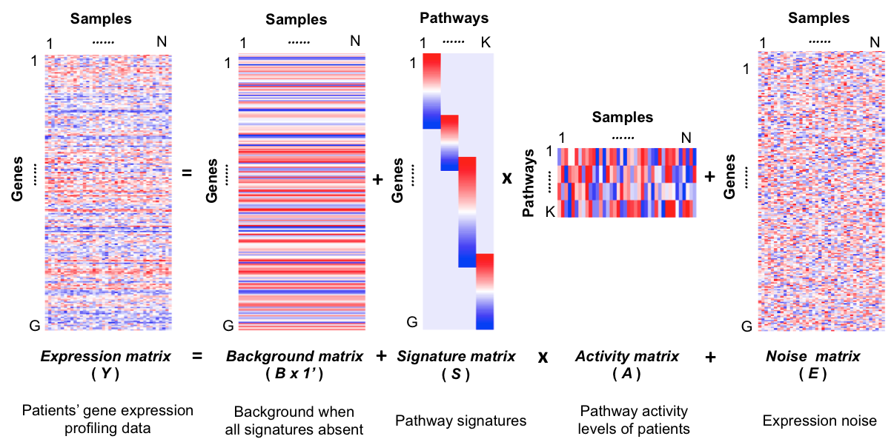
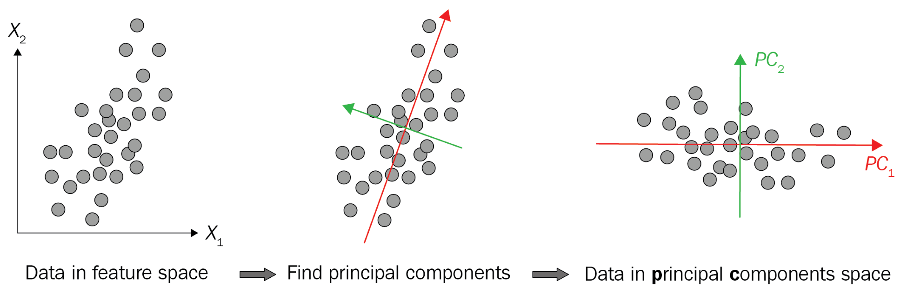
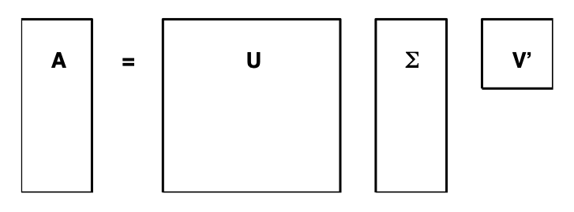
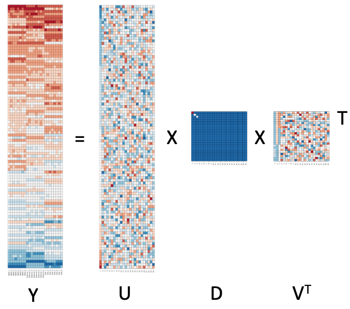
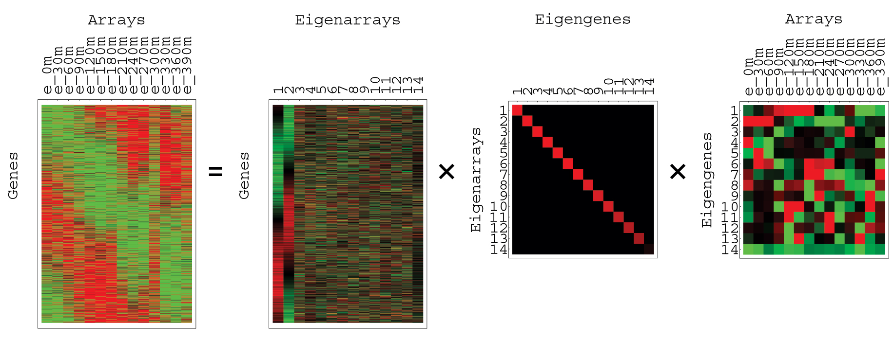

```{r setup, include=FALSE}
knitr::opts_chunk$set(echo = TRUE)
library(caret)
library(tidyverse)
img_path <- "dimRedFigs/"
```

##  Dimension reduction 

A typical machine learning challenge will include a large number of predictors, which makes visualization somewhat challenging. We have shown methods for visualizing univariate and paired data, but plots that reveal relationships between many variables are more complicated in higher dimensions. 

##  Dimension reduction : motivation 
Microbiome 16S data example: why we need dimension reduction

```{r, eval=F}
library(animalcules)
run_animalcules()
```

##  Dimension reduction : motivation 
\center
{width=90%}

##  Dimension reduction 

Here we describe powerful techniques useful for exploratory data analysis, among other things, generally referred to as __dimension reduction__. 

The general idea is to reduce the dimension of the dataset while preserving important characteristics, such as the distance between features or observations.

The technique behind it all, the singular value decomposition, is also useful in other contexts. Principal component analysis (PCA) is the approach we will be showing first. Before applying PCA to high-dimensional datasets, we will motivate the ideas behind with a simple example.


## Dimension reduction: twin heights 

We consider an= simulated example with twin heights (children and adults):

```{r, message=FALSE}
set.seed(1988)
library(MASS)
n <- 100
Sigma <- matrix(c(9, 9 * 0.9, 9 * 0.92, 9 * 1), 2, 2)
x <- rbind(mvrnorm(n / 2, c(69, 69), Sigma),
           mvrnorm(n / 2, c(55, 55), Sigma))
```

## Dimension reduction: twin heights 
A scatterplot reveals that the correlation is high and there are two groups of twins: adults and children:

<!--
```{r simulated-twin-heights, fig.width=3, fig.height=3, echo=FALSE, message=FALSE, out.width="50%"}
lim <- c(48, 78)
rafalib::mypar()
plot(x, xlim=lim, ylim=lim)
```
-->

```{r distance-illustration, fig.width=3, fig.height=3, echo=FALSE, out.width="50%", fig.align='center'}
plot(x, xlim=lim, ylim=lim, xlab='Twin 2',ylab='Twin 1')
#lines(x[c(1, 2),], col = "blue", lwd = 2)
#lines(x[c(2, 51),], col = "red", lwd = 2)
points(x[c(1, 2, 51),], pch = 16)
```

## Dimension reduction: twin heights 
Our features are $N$ two-dimensional points, the two heights, and, for illustrative purposes, we will act as if visualizing two dimensions is too challenging. We therefore want to reduce the dimensions from two to one, but still be able to understand important characteristics of the data, for example that the observations cluster into two groups: adults and children.


## Dimension reduction: twin heights 
Now, can we pick a one-dimensional summary that makes this approximation even better?

If we look back at the previous scatterplot and visualize a line between any pair of points, the length of this line is the distance between the two points. These lines tend to go along the direction of the diagonal. Notice that if we instead plot the difference versus the average:

```{r}
z  <- cbind(average=(x[,2] + x[,1])/2,  
            difference=x[,2] - x[,1])
```

## Dimension reduction: twin heights 
We can see how the distance between points is mostly explained by the first dimension: the average.

```{r rotation, fig.width=3, fig.height=3, echo=FALSE, out.width="50%", fig.align='center'}
plot(z, xlim=lim, ylim = lim - mean(lim))
#lines(z[c(1,2),], col = "blue", lwd = 2)
#lines(z[c(2,51),], col = "red", lwd = 2)
points(z[c(1,2,51),], pch = 16)
```

## Linear transformations 

Note that each row of $X$ was transformed using a linear transformation. For any row $i$, the first entry was: 

$$Z_{i,1} = a_{1,1} X_{i,1} + a_{2,1} X_{i,2}$$

with $a_{1,1} = 0.5$ and $a_{2,1} = 0.5$.

The second entry was also a linear transformation:

$$Z_{i,2} = a_{1,2} X_{i,1} + a_{2,2} X_{i,2}$$

with $a_{1,2} = 1$ and $a_{2,2} = -1$.

## Linear transformations 
More formally, we can write the operation we just performed like this:

$$
Z = X A
\mbox{ with }
A = \,
\begin{pmatrix}
1/2&1\\
1/2&-1\\
\end{pmatrix}.
$$

```{r}
A <- matrix(c(1/2,1/2,1,-1), nrow=2)
z <- x%*%A
head(z)
```


## Linear transformations 
And that we can transform back by simply multiplying by $A^{-1}$ as follows:

$$
X = Z A^{-1} 
\mbox{ with }
A^{-1} = \,
\begin{pmatrix}
1&1\\
1/2&-1/2\\
\end{pmatrix}.
$$
```{r}
A <- matrix(c(1/2,1/2,1,-1), nrow=2)
x <- z%*%solve(A)
head(x)
```

## Linear transformations 
Dimension reduction can often be described as applying a transformation $A$ to a matrix $X$ with many columns that _moves_ or _rotates_ the information contained in $X$ to the first few columns of $Z=AX$, then keeping just these few informative columns, thus reducing the dimension of the vectors contained in the rows.

##  Principal component analysis 



## Principal component analysis {#pca}

The __first principal component (PC)__ of a matrix $X$ is the linear orthogonal transformation of $X$ that maximizes the variability. The function `prcomp` provides this info:

```{r}
pca <- prcomp(x)
pca
```


## Principal component analysis 
Note that the first PC is (almost) the same as the mean we used earlier and the second is (almost) the difference!

The function PCA returns both the rotation needed to transform $X$ so that the variability of the columns is decreasing from most variable to least (accessed with `$rotation`) as well as the resulting new matrix (accessed with `$x`).

```{r}
names(pca)
```

## Principal component analysis 
For example:

```{r}
z  <- cbind(average=(x[,2] + x[,1])/2,  
            difference=x[,2] - x[,1])
head(cbind(z, pca$x))
```

## Principal component analysis 
We can visualize these to see how the components summarize the data:


```{r illustrate-pca-twin-heights, echo=FALSE, height = 5, out.width="50%",fig.align='center'}
illustrate_pca <- function(x, flip=1, 
                           pad = round((nrow(x)/2-ncol(x))*1/4), 
                           cex = 5, center = TRUE){
  rafalib::mypar(1,5)
  ## flip is because PCA chooses arbitrary sign for loadings and PC
  colors = rev(RColorBrewer::brewer.pal(9, "RdBu"))
  
  pca <- prcomp(x, center = center)
  if(center) z <- t(x) - rowMeans(t(x))
  
  cols <- 1:ncol(x)
  rows <- 1:nrow(x)
  image(cols, rows, z[,rev(1:ncol(z))], xaxt = "n", yaxt = "n", 
        xlab="", ylab="", main= "X", col = colors)
  abline(h=rows + 0.5, v = cols + 0.5)

  rafalib::nullplot(xaxt="n",yaxt="n",bty="n")
  text(0.5, 0.5, "=", cex = cex)
  
  z <- flip*t(pca$x)
  image(cols, rows, z[,rev(1:ncol(z))], xaxt = "n", yaxt = "n",xlab="",ylab="", main= "Weights", col = colors)
  abline(h=rows + 0.5, v = cols + 0.5)

  rafalib::nullplot(xaxt="n",yaxt="n",bty="n")
  text(0.5, 0.5, "x", cex = cex)
  
  z <- flip*pca$rotation
  nz <- cbind(matrix(NA, ncol(z), pad), z, matrix(NA, ncol(z), pad))
  rows <- 1:ncol(nz)
  image(cols, rows, nz[,rev(1:ncol(nz))],  xaxt = "n", yaxt = "n", bty = "n", xlab="",ylab="", col = colors)
  abline(h = pad+0:ncol(z)+1/2)
  lines(c(ncol(z)/2+0.5,ncol(z)/2+1/2),c(pad,pad+ncol(z))+0.5)
  text(ncol(z)/2+0.5, pad+ncol(z)+2 , expression(bold(Pattern^T)), font=2)
}
rafalib::mypar(1,1)
illustrate_pca(x, flip = -1)
```

## Principal component analysis 
It turns out that we can find this linear transformation not just for two dimensions but for matrices of any dimension $p$. Thus, for a matrix with $X$ with $p$ columns, we can find a transformation that creates $Z$ for which the first column is the first principal component, the second column is the second principal component, and so on. 

If after a certain number of columns, say $k$, the variances of the columns of $Z_j$, $j>k$ are very small, it means these dimensions have little to contribute to the distance and we can approximate distance between any two points with just $k$ dimensions. If $k$ is much smaller than $p$, then we can achieve a very efficient summary or **reduction** of our data.

## Iris example

The iris data is a widely used example in data analysis courses. It includes four botanical measurements related to three flower species:
\small
```{r}
head(iris)
```

## Iris example
Let's compute the distance between each observation. You can clearly see the three species with one species very different from the other two:
\small
```{r iris-distances, fig.width = 4, fig.height = 4, out.width="30%", fig.align='center'}
x <- iris[,1:4] %>% as.matrix()
d <- dist(x)
image(as.matrix(d), col = rev(RColorBrewer::brewer.pal(9, "RdBu")))
```


## Iris example
Our predictors here have four dimensions, but three are very correlated:
\small
```{r}
cor(x)
```

If we apply PCA, we should be able to approximate this distance with just two dimensions, compressing the highly correlated dimensions. 

## Iris example
Using the `summary` function we can see the variability explained by each PC:

```{r}
pca <- prcomp(x)
summary(pca)
```

## Iris example
The first two dimensions account for 97% of the variability. Thus we should be able to approximate the distance very well with two dimensions. We can visualize the results of PCA:

```{r illustrate-pca-twin-heights-iris, echo=FALSE, fig.height = 6, out.width="50%", fig.align='center'}
rafalib::mypar()
illustrate_pca(x)
```

## Iris example
We plot the first two PCs with color representing the species:
\small
```{r iris-pca, out.width="80%", fig.align='center'}
data.frame(pca$x[,1:2], Species=iris$Species) %>% 
  ggplot(aes(PC1,PC2, fill = Species))+
  geom_point(cex=3, pch=21) +
  coord_fixed(ratio = 1)
```

## Non-linear transformations: UMAP
Check out the following links:

* [https://pair-code.github.io/understanding-umap/](https://pair-code.github.io/understanding-umap/)
* [https://pair-code.github.io/understanding-umap/supplement.html](https://pair-code.github.io/understanding-umap/)

## Non-linear transformations: UMAP
The intuitions behind the core principles are actually quite simple: UMAP essentially constructs a weighted graph from the high dimensional data, with edge strength representing how “close” a given point is to another, then projects this graph down to a lower dimensionality. The advanced mathematics (topology) gives UMAP a solid footing with which to handle the challenges of doing this in high dimensions with real data.

## Iris example
\small
```{r iris-umap, fig.height = 6, out.width="80%", fig.align='center'}
library(umap)
umap_iris <- umap(iris[,1:4])
data.frame(umap_iris$layout, Species=iris$Species) %>% 
  ggplot(aes(X1,X2, fill = Species))+
  geom_point(cex=3, pch=21) +
  coord_fixed(ratio = 1)
```

## Eigenvectors and Eigenvalues
An **eigenvalue** and **eigenvector** of a square matrix ${\bf A}$ are a scalar $\lambda$ and a nonzero vector ${\bf x}$ so that
$${\bf Ax} = \lambda{\bf x}.$$

__Historical note:__ The prefix _eigen-_ is adopted from the German word for "proper", "characteristic", "own". Eigenvalues and eigenvectors were originally used in physics to study principal axes of the rotational motion of rigid bodies, but have been found to be useful in a wide range of applications.

## Eigenvectors and Eigenvalues
The eigenvalue-eigenvector equation for a \underline{square} matrix can be written 
$$({\bf A}-\lambda{\bf I}){\bf x}=0, {\bf x}\ne 0.$$
This implies that ${\bf A}-\lambda{\bf I}$ is singular and hence that 
$$det({\bf A}-\lambda{\bf I}) = 0.$$
This definition of an eigenvalue, which does not directly involve the corresponding eigenvector, is the __characteristic equation__ or __characteristic polynomial__ of ${\bf A}$.

## Eigenvectors and Eigenvalues
Let $\lambda_1,\lambda_2,\ldots \lambda_n$ be the eigenvalues of a matrix ${\bf A}$ and denote $\Lambda$ denote the $n$-by-$n$ diagonal matrix with the $\lambda_j$ on the diagonal. Also let ${\bf x}_1,{\bf x}_2,\ldots,{\bf x}_n$ be a set of corresponding eigenvectors and and let ${\bf X}$ denote the $n$-by-$n$ matrix whose $j$th column is ${\bf x}_j$. 

Then note the following is true:
$${\bf AX} = {\bf X}\Lambda.$$

## Eigenvectors and Eigenvalues
Now make a key assumption that is not true for all matrices—assume that the eigenvectors are linearly independent. Then ${\bf X}^{-1}$ exists and
$${\bf A} = {\bf X}\Lambda {\bf X}^{-1},$$
with nonsingular ${\bf X}$. This is known as the __eigenvalue decomposition__ of the matrix ${\bf A}$. If it exists, it allows us to investigate the properties of ${\bf A}$ by analyzing the diagonal matrix $\Lambda$. 

For example, matrix powers can be expressed in terms of powers of scalars:
$${\bf A}^p = {\bf X}\Lambda^p{\bf X}^{-1}.$$

## Eigenvectors and PCA
**Principal Components Analysis (PCA)** of an $N\times p$ matrix/dataset ${\bf Y}$ is determined by an eigenvalue decomposition on the **covariance matrix** of ${\bf Y}$:
$$Cov( {\bf Y} ) =  {\bf X}\Lambda{\bf X}^{-1},$$
where $\Lambda$ is a diagonal matrix representing the ordered (decreasing) eigenvalues and ${\bf X}$ is a matrix of corresponding eigenvectors (same order as $\Lambda$). The eigenvectors in the columns of ${\bf X}$, provide the **rotation** or **loadings** that comprise the linear combinations of the original covariates. The eigenvalues represent the relative **variance contribution** of each of the linear combinations (eignevectors). 

The rotation can then be applied to the original data to obtain the **principal components** or **PC**s, which are ordered by variance contribution (i.e., PC1 explains the most variation, etc.).  


## Singular value decomposition 
A **Singular Value Decomposition (SVD)** is an extension of the ideas behind the eigenvalue decomposition and PCA, but factorizes ${\bf Y}$ directly. It is widely used in machine learning, both in practice and to understand the mathematical properties of some algorithms. 

The SVD __decomposes__ an $N\times p$ data matrix $Y$ with $p < N$ as 
$$ Y = U D V^{\top} $$
With $U$ and $V$ __orthogonal__ of dimensions $N\times p$ and $p\times p$, respectively, and $D$ a $p \times p$ __diagonal__ matrix with the values of the diagonal decreasing: 

$$d_{1,1} \geq d_{2,2} \geq \dots d_{p,p}.$$ 

## Singular value decomposition 
Visually, the SVD looks something like this:



## Singular value decomposition 
We will construct a dataset of grade scores for 100 students in 24 different subjects. The overall average has been removed so this data represents the percentage point each student received above or below the average test score. So a 0 represents an average grade (C), a 25 is a high grade (A), and a -25 represents a low grade (F):

\small
```{r}
set.seed(1987)
n <- 100
k <- 8
Sigma <- 64  * matrix(c(1, .75, .5, .75, 1, .5, .5, .5, 1), 3, 3) 
m <- MASS::mvrnorm(n, rep(0, 3), Sigma)
m <- m[order(rowMeans(m), decreasing = TRUE),]
y <- m %x% matrix(rep(1, k), nrow = 1) +
  matrix(rnorm(matrix(n * k * 3)), n, k * 3)
colnames(y) <- c(paste(rep("Math",k), 1:k, sep="_"),
  paste(rep("Science",k), 1:k, sep="_"), paste(rep("Arts",k), 1:k, sep="_"))
``` 

## Singular value decomposition 
We can visualize the 24 test scores for the 100 students below. Are all students just about as good? Does being good in one subject imply you will be good in another? How does the SVD help with all this?  

```{r, echo=FALSE, fig.align='center', out.width="50%"}
my_image <- function(x, zlim = range(x), ...){
  colors = rev(RColorBrewer::brewer.pal(9, "RdBu"))
  cols <- 1:ncol(x)
  rows <- 1:nrow(x)
  image(cols, rows, t(x[rev(rows),,drop=FALSE]), xaxt = "n", yaxt = "n",
        xlab="", ylab="",  col = colors, zlim = zlim, ...)
  abline(h=rows + 0.5, v = cols + 0.5)
  axis(side = 1, cols, colnames(x), las = 2)
}

my_image(y)
```


## Singular value decomposition 
\Large
How would you describe the data based on this figure?

a. The test scores are all independent of each other.
b. The students that test well are at the top of the image and there seem to be three groupings by subject.
c. The students that are good at math are not good at science.
d. The students that are good at math are not good at humanities.

## Singular value decomposition 
We can examine the correlation between the test scores directly like this:

```{r, echo=FALSE, fig.align='center', out.width="60%"}
my_image(cor(y), zlim = c(-1,1))
range(cor(y))
axis(side = 2, 1:ncol(y), rev(colnames(y)), las = 2)
```

## Singular value decomposition 
\Large
Which of the following best describes what you see?

a. The test scores are independent.
b. Math and science are highly correlated but the humanities are not.
c. There is high correlation between tests in the same subject but no correlation across subjects.
d. There is a correlation among all tests, but higher if the tests are in science and math and even higher within each subject.

## Singular value decomposition 
\Large
Use the function `svd` to compute the SVD of `y`. This function will return $U$, $V$ and the diagonal entries of $D$. 

```{r}
s <- svd(y)
names(s)
```

## Singular value decomposition 
\large
And we can look at the sizes of the outputs:
```{r}
dim(s$d)
dim(s$u)
dim(s$v)
```

## Singular value decomposition 
\Large
And we can check that the SVD works by typing:

```{r}
y_svd <- s$u %*% diag(s$d) %*% t(s$v)
max(abs(y - y_svd))
```

## Singular value decomposition 
Visualizing the SVD: Y 

```{r, echo=FALSE, fig.align='center', out.width="60%"}
my_image(y)
```

## Singular value decomposition 
Visualizing the SVD: U 
```{r, echo=FALSE, fig.align='center', out.width="60%"}
my_image(s$u)
```

## Singular value decomposition 
Visualizing the SVD: diag(D)
\center
```{r, echo=FALSE, fig.align='center', out.width="60%"}
my_image(diag(s$d))
```

## Singular value decomposition 
Notice the following:
\tiny
```{r}
s$d
s$d^2/sum(s$d^2)
cumsum(s$d^2)/sum(s$d^2)
```


## Singular value decomposition 
Visualizing the SVD: V
```{r, echo=FALSE, fig.align='center', out.width="60%"}
my_image(s$v)
```

## Singular value decomposition 
Putting them all together
```{r,eval=F, echo=F}
png(filename = "y.png", width = 480, height = 2000, units = "px", pointsize = 12)
my_image(y)
dev.off()

png(filename = "u.png", width = 480, height = 2000, units = "px", pointsize = 12)
my_image(s$u)
dev.off()

png(filename = "d.png", width = 480, height = 480, units = "px", pointsize = 12)
my_image(diag(s$d))
dev.off()

png(filename = "v.png", width = 480, height = 480, units = "px", pointsize = 12)
my_image(s$v)
dev.off()
```

\center

{width=40%}


    
    

## Singular value decomposition
\center
{width=50%}


## Singular value decomposition 
\center
{width=80%}


## Singular value decomposition 


## Factor analysis models
{width=90%}

## Non-Negative Matrix Factorization (NMF)
\Large
Similar to SVD, **Non-Negative Matrix Factorization (NMF)** is a linear dimensionality reduction technique.

* It decomposes a non-negative data matrix $\mathbf{V}$ into two lower-rank non-negative matrices, $\mathbf{W}$ and $\mathbf{H}$:
    $$\mathbf{V} \approx \mathbf{W} \mathbf{H}$$
    where $\mathbf{V}$ is $N \times P$, $\mathbf{W}$ is $N \times K$, and $\mathbf{H}$ is $K \times P$.

* The constraint that all elements in $\mathbf{W}$ (features/basis) and $\mathbf{H}$ (coefficients/weights) must be **non-negative** is key.

## Non-Negative Matrix Factorization: Interpretation
\Large
The non-negativity constraint leads to a fundamentally different, often more **interpretable** factorization:

* **Additive, Parts-Based Representation:** Unlike PCA/SVD, NMF relies on a purely additive combination of components. It decomposes the data into meaningful **"parts"** that add up to form the original data.
* **Ideal for Non-Negative Data:** NMF is particularly well-suited for data where negative values are either impossible or meaningless, such as image pixel intensities, gene expression levels, or term frequency counts.

## Non-Negative Matrix Factorization: Theory & Fitting

\Large
The core problem in NMF is finding two non-negative matrices, $\mathbf{W}$ and $\mathbf{H}$, that best approximate the data $\mathbf{V}$:

$$\mathbf{V} \approx \mathbf{W} \mathbf{H}$$

This is a non-linear, non-convex **optimization problem** solved by minimizing a cost function (or objective function).

## Non-Negative Matrix Factorization: Theory & Fitting

\Large
* **Common Cost Functions (Loss Functions):**
    1.  **Frobenius Norm:** $\mathcal{D}_F(\mathbf{V} || \mathbf{WH}) = \frac{1}{2} \sum_{i,j} (V_{ij} - (WH)_{ij})^2$
    2.  **Kullback-Leibler (KL) Divergence:** Often used for count data, as it is related to maximum likelihood estimation for the Poisson distribution.
* **Non-Convexity:** Since the problem is non-convex, the final solution can depend on the **initial random guess** for $\mathbf{W}$ and $\mathbf{H}$, meaning different runs may converge to different local minima. Running the algorithm multiple times (as we will do with `nrun=20`) helps find a better solution.

## NMF: Multiplicative Update Algorithm 
\Large
The most popular method for minimizing the Frobenius Norm cost function is the **Multiplicative Update Rule**, developed by Lee and Seung (2001).

This method avoids standard gradient descent's subtraction step, ensuring that the non-negativity constraints for $\mathbf{W}$ and $\mathbf{H}$ are always met. It uses a sequence of iterative **multiplicative updates** until convergence.

## NMF: Multiplicative Update Algorithm 
\Large
The update rules for the $N \times K$ basis matrix $\mathbf{W}$ and the $K \times P$ coefficient matrix $\mathbf{H}$ are:

* **Update $\mathbf{H}$:**
    $$H_{a\mu} \leftarrow H_{a\mu} \frac{(\mathbf{W}^T \mathbf{V})_{a\mu}}{(\mathbf{W}^T \mathbf{WH})_{a\mu}}$$
* **Update $\mathbf{W}$:**
    $$W_{i\alpha} \leftarrow W_{i\alpha} \frac{(\mathbf{V} \mathbf{H}^T)_{i\alpha}}{(\mathbf{WH} \mathbf{H}^T)_{i\alpha}}$$

These updates are designed such that the cost function is non-increasing, guaranteeing convergence.

## NMF vs. Other Techniques
\footnotesize
| Technique | Decomposition | Key Constraint | Best Suited For |
| :--- | :--- | :--- | :--- |
| **PCA** | $\mathbf{X} = \mathbf{T} \mathbf{P}^T + \mathbf{E}$ | **Orthogonal** principal components. | General dimensionality reduction, variance maximization. |
| **SVD** | $\mathbf{Y} = \mathbf{U} \mathbf{D} \mathbf{V}^\top$ | $\mathbf{U}$ and $\mathbf{V}$ are **orthogonal**. | Low-rank approximation, matrix structure analysis. |
| **UMAP** | Non-linear projection. | **Topological** preservation (preserving local/global data structure). | **Visualization** of complex, high-dimensional manifolds. |
| **NMF** | $\mathbf{V} \approx \mathbf{W} \mathbf{H}$ | $\mathbf{V}$, $\mathbf{W}$, and $\mathbf{H}$ must be **non-negative**. | **Parts-based representation** in non-negative data. |

## When to Use NMF Over PCA, SVD, or UMAP?
\Large
* **Primary Condition:** Your data matrix $\mathbf{V}$ must be **non-negative** (e.g., counts, frequencies, magnitudes). If your data has negative values, you must shift it to be non-negative before applying NMF.
* **The Interpretability Advantage:** You should choose NMF when your goal is to achieve an **interpretable, additive, "parts-based" decomposition**.
    * **PCA/SVD** components are a mix of positive and negative values, making them "holistic" (like a linear combination of all features).
    * **NMF** components ($\mathbf{W}$) are purely additive. They represent distinct, localized **parts** that combine to form the original observations.

## When to Use NMF Over PCA, SVD, or UMAP?
\Large
* **Use Cases Where NMF Excels:**
    * **Topic Modeling:** Discovering how non-negative word frequencies combine into distinct, non-negative **topics**.
    * **Image Feature Extraction:** Decomposing images into a non-negative basis of facial **parts** (e.g., eyes, nose, mouth).
    * **Gene Expression:** Identifying non-negative **gene signatures** or pathways.
    
    
## NMF: Iris Example
\Large
Since the **Iris dataset** features (sepal length/width, petal length/width) are all non-negative measurements, NMF is applicable.

We can apply NMF with a low rank $K=2$ to visualize the data in two dimensions, similar to the PCA and UMAP examples.

## NMF: Iris Example
```{r iris-nmf, fig.height = 6, out.width="80%", fig.align='center', message=FALSE, warning=FALSE}
library(NMF)
# The iris data is inherently non-negative
x_nmf <- iris[, 1:4] %>% as.matrix()
set.seed(42) # Set seed for reproducibility

# Perform NMF with rank k=2
# nrun=20 is recommended for better stability
nmf_res <- nmf(x_nmf, 2, nrun=20) 
```
## NMF: Iris Example
```{r iris-nmf1, eval=F, fig.height = 6, out.width="80%", fig.align='center', message=FALSE, warning=FALSE}
# The transformed data is in the 'basis' matrix W
nmf_transformed <- basis(nmf_res) 
colnames(nmf_transformed) <- c("NMF1", "NMF2")

# Visualization
data.frame(nmf_transformed, Species = iris$Species) %>%
  ggplot(aes(NMF1, NMF2, fill = Species)) +
  geom_point(cex = 3, pch = 21) +
  coord_fixed(ratio = 1)
```

## NMF: Iris Example
```{r iris-nmf2, echo=F, fig.height = 6, out.width="100%", fig.align='center', message=FALSE, warning=FALSE}
nmf_transformed <- basis(nmf_res) 
colnames(nmf_transformed) <- c("NMF1", "NMF2")

data.frame(nmf_transformed, Species = iris$Species) %>%
  ggplot(aes(NMF1, NMF2, fill = Species)) +
  geom_point(cex = 3, pch = 21) +
  coord_fixed(ratio = 1)
```

## NMF: Iris Example Interpretation 

\Large
The resulting NMF plot:

* **Clustering:** The __Setosa__ species (blue) is distinctly separate, largely driven by the first NMF component.
* **Non-Negative Axes:** The data is confined to the positive quadrant of the plot, which is characteristic of NMF and results in an additive decomposition.
* **Components ($\mathbf{H}$):** The magnitude of the entries in the component matrix $\mathbf{H}$ (accessed via `coef(nmf_res)`) can reveal the contribution of each original feature to the separation.


## Session Info
\tiny
```{r session}
sessionInfo()
```
