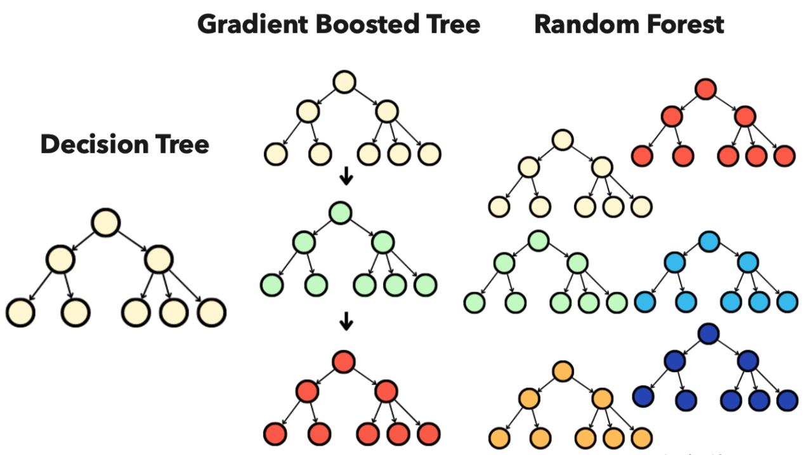
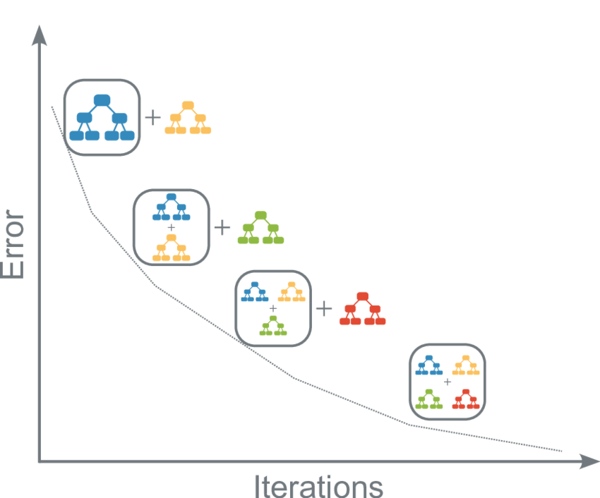

```{r setup, include=FALSE}
knitr::opts_chunk$set(echo = TRUE, fig.align="center")
library(caret)
library(tidyverse)
img_path <- "treeFigs/"
```


##  Ensemble Methods: Bagging vs. Boosting

\Large
**Ensemble methods** combine the predictions of multiple individual models (often called **weak learners**, like decision trees) to create a single, highly accurate predictor.

The two main strategies for building ensembles are:

\normalsize
\begin{itemize}
    \item \textbf{Bagging (Bootstrap Aggregation)}: A {\it parallel} method where models are built independently and then averaged/combined. Used in \textbf{Random Forests}.
    \item \textbf{Boosting}: A {\it sequential} method where models are built iteratively, with each new model focusing on correcting the errors of the previous ones. Used in \textbf{XGBoost} (introduced soon).
\end{itemize}

---

## Ensemble Methods: Bagging vs. Boosting
\center
{width="80%"}

## Bagging (Bootstrap Aggregation)

\Large
Bagging is a technique designed primarily to **reduce variance** in high-variance models, such as deep decision trees.

\small
\begin{enumerate}
    \item \textbf{Parallelism}: $B$ independent models are trained simultaneously.
    \item \textbf{Bootstrap Sampling}: Each model is trained on a unique {\it bootstrap sample} (sampling with replacement) of the original training data. This ensures the individual trees are diverse (random).
    \item \textbf{Final Prediction}: The predictions from all $B$ models are combined by:
    \begin{itemize}
        \item \textbf{Averaging} (for regression, e.g., Random Forest).
        \item \textbf{Majority Vote} (for classification, e.g., Random Forest).
    \end{itemize}
\end{enumerate}

\normalsize
The final averaged model has a significantly lower variance than any single tree, but the bias remains roughly the same.

---

## Boosting (Sequential Error Correction)

\Large
Boosting is an iterative technique designed primarily to *reduce bias* and create a single strong learner from a sequence of weak learners.

\small
\begin{enumerate}
    \item \textbf{Sequential Dependence}: Models are trained {\it one after the other}.
    \item \textbf{Error Focus}: Each subsequent model is trained to predict the {\it residuals} (the errors) of the combined ensemble created up to that point.
    \item \textbf{Weighted Combination}: New models are added to the ensemble using a small {\it learning rate ($\eta$)} to ensure the model learns slowly and prevents dramatic overfitting.
\end{enumerate}

\normalsize
Boosting can achieve very high predictive accuracy but requires careful tuning to avoid overfitting the training data, as seen with the complexity parameters in XGBoost.

---

## Introducing Gradient Boosting Machines (GBMs)
\Large Gradient Boosting Machines (GBMs) is the general class of ensemble methods that utilizes the boosting principle.

\small \textbf{How it relates to Boosting and XGBoost:} 

\begin{itemize} 
  \item Boosting Foundation: GBMs use the sequential error correction strategy (Boosting), where new trees correct the mistakes of the previous ensemble. 
  \item Gradient Descent: The "Gradient" in GBM refers to the use of gradient descent—an optimization algorithm—to precisely identify the errors (residuals) and determine the ideal direction for the next tree to move in to minimize the model's overall loss function. 
  \item XGBoost is an Implementation: XGBoost is simply a modern, highly optimized, and regularized (L1/L2) implementation of the GBM algorithm. \end{itemize}


\normalsize GBMs are generally more complex to train than Random Forests but often achieve superior predictive accuracy by aggressively reducing model bias.


## Introducing Gradient Boosting Machines (GBMs)
\center
{width=50%}

## GBM Example: Iris

```{r}
# Load the iris dataset and set up training control
data("iris")
set.seed(42) # Set seed for reproducibility

# 5-fold Cross-Validation
ctrl <- trainControl(method = "cv", number = 5)

# GBM Tuning Grid
gbmGrid <- expand.grid(n.trees = c(50, 100, 150),
                       interaction.depth = c(1, 3, 5),
                       shrinkage = c(0.1),
                       n.minobsinnode = 10)
```

## GBM Example: Iris
```{r}
# Train the GBM model
gbm_fit <- train(Species ~ ., data = iris,
  method = "gbm", trControl = ctrl,
  verbose = FALSE, tuneGrid = gbmGrid)

# Print best model results
print(gbm_fit)
```

## GBM Example: Iris
```{r,fig.height=5,fig.width=7, out.width="50%"}
# Plot the tuning results
plot(gbm_fit)
```

## GBM Example: Iris
\footnotesize
```{r}
gbm_predictions <- predict(gbm_fit, newdata = iris)
confusionMatrix(gbm_predictions, iris$Species)
```


## Extreme Gradient Boosting (XGBoost)

\Large
**XGBoost** (Extreme Gradient Boosting) is a highly optimized and scalable implementation of **Gradient Boosting Machines (GBMs)**. It builds upon the idea of decision trees and boosting.

## Extreme Gradient Boosting (XGBoost)
\Large
The core idea is **sequential error correction**:
\normalsize
1.  **Tree 1 (Weak Learner):** Makes an initial prediction.
2.  **Tree 2:** Is trained to predict and correct the **residual errors** (or gradients of the loss function) from the combined output of all previous trees.
3.  This process continues, with each new tree $f_k(\mathbf{x})$ added to the ensemble to minimize the total error.

$$\hat{y} = \hat{y}_0 + \sum_{k=1}^K \eta \cdot f_k(\mathbf{x})$$

The final prediction is the sum of the initial prediction ($\hat{y}_0$) and all subsequent tree predictions, scaled by the **learning rate** ($\eta$).

---

## XGBoost: Key Enhancements

\Large
XGBoost improves upon traditional GBMs with several critical enhancements for performance and generalization:

\normalsize
* **Regularization:** Includes both $\mathbf{L1}$ (Lasso) and $\mathbf{L2}$ (Ridge) terms in the objective function to explicitly **penalize complexity** and prevent overfitting, which is common in boosting.
* **Parallel Computing:** Optimized to run tree construction in parallel, offering significant **speed gains** compared to older GBM implementations.
* **Handling Missing Values:** It has a built-in method to intelligently handle missing data by allowing the algorithm to **learn the best path** (left or right split) for null values.
* **Learning Rate ($\eta$):** A small $\eta$ (e.g., $0.01$ to $0.3$) is used to **shrink** the contribution of each tree, making the learning process slow and more robust, requiring more trees (`nrounds`).

\Large XGBoost often yields superior accuracy compared to Random Forests, but remains relatively interpretable through Feature Importance plots.

---


## LIME: Local Explanations

\Large
**LIME** focuses on explaining an **individual prediction** by building a simple, interpretable model *around* the prediction point.

\small
**Intuition: Trusting a local neighborhood.**
\begin{enumerate}
    \item \textbf{Select a prediction}: Choose one data point $\mathbf{x}$ to explain.
    \item \textbf{Generate neighbors}: Perturb the data point $\mathbf{x}$ to create many new, slightly modified "neighbor" points.
    \item \textbf{Weight neighbors}: Weight these neighbors based on their proximity to $\mathbf{x}$.
    \item \textbf{Train a simple model}: Train a simple, interpretable model (like a linear regression or a shallow decision tree) on these weighted, perturbed data points.
    \item \textbf{Explain}: The parameters of the simple model locally approximate the behavior of the complex model and provide the feature contribution for that single prediction.
\end{enumerate}

\normalsize
**Key Feature**: LIME explanations are **local**—they only explain *why* a specific data point $\mathbf{x}$ received its prediction. 

## SHAP: Global and Local Explanations

\Large
**SHAP** connects optimal feature attribution with game theory, providing a single, consistent framework to measure the contribution of each feature.

\small
SHAP values are based on **Shapley values** from cooperative game theory.

\begin{itemize}
    \item The features of a model are considered the "players" in a "coalition."
    \item The prediction is the "payout."
    \item The SHAP value for a feature is its average marginal contribution across all possible feature combinations (coalitions).
\end{itemize}

**Key Properties:**
\begin{itemize}
    \item **Consistency**: A feature that contributes more (or the same) to the prediction should always be assigned a higher (or equal) SHAP value.
    \item **Model-Agnostic**: Can be used for any model, although faster implementations exist for tree ensembles (Tree SHAP).
    \item **Global and Local**: SHAP can explain a single prediction (**Local**) and can be aggregated to visualize overall feature importance and relationships (**Global**).
\end{itemize}

\normalsize
**Interpretation**: A SHAP value represents the feature's contribution to the prediction, pushing it either higher or lower than the average prediction. 


## Session Info
\tiny
```{r session}
sessionInfo()
```
