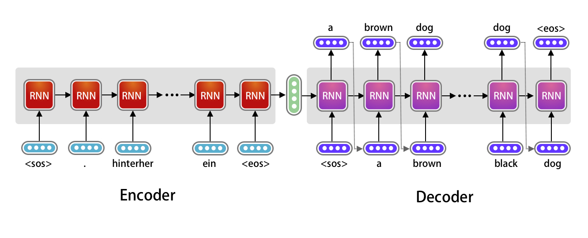
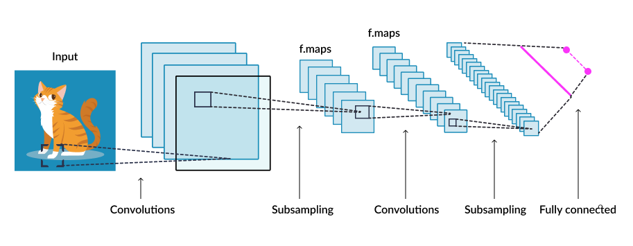
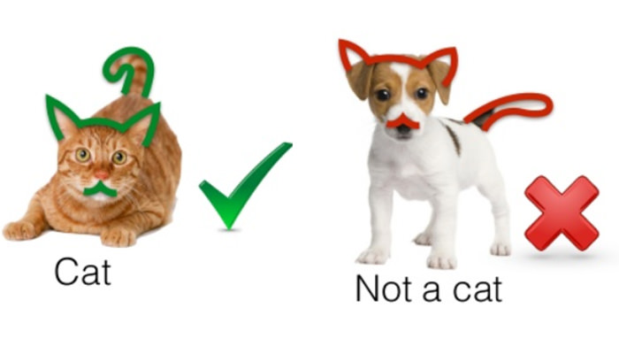
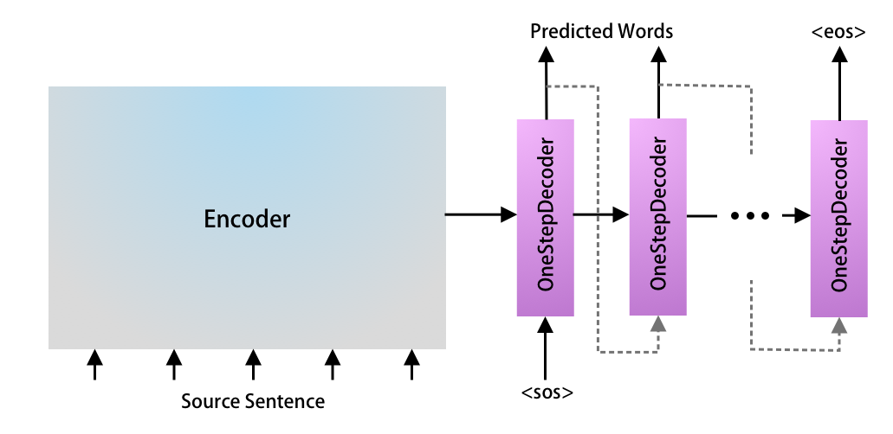
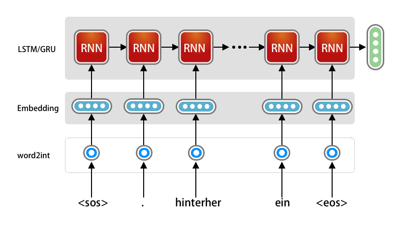
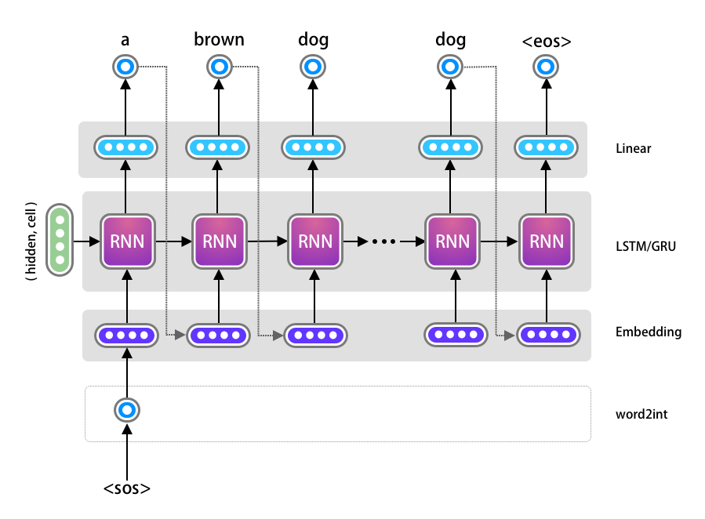

```{r setup, include=FALSE}
library(knitr)
opts_chunk$set(echo = TRUE,
               out.width = "50%", 
               fig.align = "center")
library(caret)
library(tidyverse)
img_path <- "nnFigs/"
```


## Homework and Plans
\Large

1. Homework 3: Dimension reduction, SVM, RF, XGBoost, SHAP/LIME, NN on TB Nanostring data (Due 12/12).
2. Homework 4 (Final Project): Analyze your own dataset using concepts from this class (Due 12/19).
3. Next week's lectures: Office hours to help with last assignment and final project

## Introduction to Neural Networks
\Large
The human brain consists of billions of neural cells that process information. Each neural cell considered a simple processing system. The interconnected web of neurons, also known as a __biological neural network__, transmits information through electrical signals from neuron to neuron. 

The dendrites of a neuron receive input signals from another neuron. The cell body, or soma, sums the inputs from multiple dendrites. Axons pass on information and output from the soma to the synapses, which are the _conjunction_ points for other neurons.

## Introduction to Neural Networks
\center
{width=85%}

## Introduction to Neural Networks
\Large
In 1944, Warren McCulloch and Walter Pitts developed the first mathematical model of a neuron. 

In their research paper "A logical calculus of the ideas immanent in nervous activity", they described the simple mathematical model for a neuron, which represents a single cell of the neural system that takes inputs, processes those inputs, and returns an output. This model is known as the McCulloch-Pitts neural model. 

## Introduction to Neural Networks
The McCulloch-Pitts neuron model looked something like this: 
\center
{width=50%}


## Introduction to Neural Networks
\Large
The neural nets described by McCullough and Pitts in 1944 had thresholds and weights, but they weren’t arranged into layers, and the researchers didn’t specify any training mechanism. 

What McCullough and Pitts showed was that a neural net could, in principle, compute any function that a digital computer could. The result was more neuroscience than computer science: The point was to suggest that the human brain could be thought of as a computing device.


## Introduction to Neural Networks
\Large
The first trainable neural network, the **Perceptron**, was demonstrated by the Cornell University psychologist Frank Rosenblatt in 1957. The Perceptron’s design was much like that of the modern neural net, except that it had only one layer with adjustable weights and thresholds, sandwiched between input and output layers.

## Introduction to Neural Networks
\Large
Perceptrons were an active area of research in both psychology and the fledgling discipline of computer science until 1959, when Minsky and Papert published a book titled "Perceptrons," which demonstrated that executing certain fairly common computations on Perceptrons would be _impractically time consuming_.

## Introduction to Neural Networks
\Large
The Perceptron model looked something like this: 
\center
{width=80%}


## Introduction to Neural Networks
\Large
Here, $x_1,x_2,\ldots,x_N$ are input (predictor) variables, $w_1,w_2,\ldots,w_N$ are weights of respective inputs, $b$ is the bias, which is summed with the weighted inputs to form the net inputs. Bias and weights are both adjustable parameters of the (computational) neuron. 

## Introduction to Neural Networks
\Large
Parameters are adjusted using learning rules trained on the $x$s. Once the weights and bias are determined, a mapping function or mechanism processes or connects the input and output of the neuron. This mechanism of mapping inputs to output is known as the **activation function**.

## Introduction to Neural Networks
The **activation function** defines the output of a neuron in terms of a local induced field. The activation function (often a single line of code!) can give the neural net non-linearity and expressiveness. Here are some examples:

* \underline{Identity}: A linear operator in vector that maps input to the same output value.
* \underline{Binary Step}: If the value of the (weigthed) input signal is above a certain threshold, the output is true (or activated), and otherwise false (or not activated). It is very useful as a binary classifier.
* \underline{Sigmoid}: Or \underline{S-shaped}: Logistic and hyperbolic tangent functions are used sigmoid functions, used for binary classification or continuous/probabilistic outputs
* \underline{Ramp} or \underline{ReLU}: Derived from the appearance of its graph, e.g,. maps negative inputs to 0 and positive inputs to the same (identity) output. _ReLu_ stands for 'Rectified Linear unit'. 

## Introduction to Neural Networks
\center
{width=60%}

## Introduction to Neural Networks
Modern **neural networks** are algorithms comprising multiple layers of connected input/output units (neurons) in which each connection has a weight associated with it. 
\center
{width=70%}

## Multilayer Perceptron Neural Network in R
Suppose we have students' technical knowledge (TKS), communication skill score (CSS), and placement status (Placed):

```{r}
TKS=c(20,10,30,20,80,30)
CSS=c(90,20,40,50,50,80)
Placed=c(1,0,0,0,1,1)
df=data.frame(TKS,CSS,Placed)
```

## Multilayer Perceptron Neural Network in R
```{r}
knitr::kable(df)
```


## Multilayer Perceptron Neural Network in R
\Large
Fit the multilayer perceptron neural network:
\footnotesize
```{r, fig.align="center", out.width="80%"}
suppressPackageStartupMessages(library(neuralnet))
set.seed(0)
nn=neuralnet::neuralnet(Placed~TKS+CSS,data=df, hidden=3,
             act.fct = "logistic", linear.output = FALSE)
names(nn)
```                

## Multilayer Perceptron Neural Network in R
\Large
We can plot or neural network:
```{r, fig.height=4, fig.width=8, fig.align='center'}
plot(nn)
```

\center
{width=80%}

## Multilayer Perceptron Neural Network in R
\Large
Creating a test set:
```{r}
TKS=c(30,40,85)
CSS=c(85,50,40)
test=data.frame(TKS,CSS)
```

## Multilayer Perceptron Neural Network in R
\Large
```{r}
knitr::kable(test)
```

## Multilayer Perceptron Neural Network in R
\Large
Prediction using neural network:
```{r}
Predict=compute(nn,test)
Predict$net.result
```

## Multilayer Perceptron Neural Network in R
\Large
Converting probabilities into binary classes setting threshold level 0.5:
```{r}
prob <- Predict$net.result
pred <- ifelse(prob>0.5, 1, 0)
pred
```


## Multilayer Perceptron Neural Network in R
\Large
Now, using the `iris` dataset: 
```{r}
set.seed(0)
nn_iris <- neuralnet(Species ~ ., data=iris, hidden=3)
```


## Multilayer Perceptron Neural Network in R
\Large
Plotting the Neural Network:  
```{r}
plot(nn_iris)
```

\center
{width=70%}


## Multilayer Perceptron Neural Network in R
\Large
Now, doing the same thing using `caret':
\normalsize
```{r}
set.seed(0)
nn_caret <- caret::train(Species~., data = iris, 
                         method = "nnet", linout = TRUE, 
                         trace = FALSE)
ps <- predict(nn_caret, iris)
confusionMatrix(ps, iris$Species)$overall["Accuracy"]
```

## Multilayer Perceptron Neural Network in R
\Large
Plotting the `caret' neural network:
```{r, fig.height=8, fig.width=12, fig.align='center', out.width="60%"}
NeuralNetTools::plotnet(nn_caret)  
```


## Introduction to Neural Networks
\Large
**Neural networks** (or **artificial neural networks**) have the ability to learn by examples, or from training data. Neural networks follow a _non-linear_ path that processes information through a complex adaptive system--by adjusting weights of inputs using a complex _network_ of artificial neurons. 

## Introduction to Neural Networks
\Large
_Neural networks_ where designed to solve problems which are easy for humans and difficult for machines. For example distinguising between pictures of cats and dogs. These problems are often referred to as pattern recognition. Current applications for neural network range from optical character recognition to object detection.

## Introduction to Neural Networks
\Large
Two of the more common artificial neural networks are: **feedforward** and **feedback** neural networks. 

A _feedforward neural network_ is a network which is non-recursive: neurons in each layer are only connected to neurons in the next layer--signals only travel in one direction towards the output layer.

## Recurrent Neural Networks (RNNs)
\Large
_Feedback neural networks_ contain cycles. Signals travel in both directions by introducing loops in the network. Feedback neural networks are also known as _recurrent neural networks_. 
\center
{width=90%}


## Introduction to Neural Networks
\Large
There are many other formulations of **deep learning** neural networks:

* Perceptron/Multilayer Perceptron
* Feedforward Neural Network
* Recurrent Neural Network
* Convolutional Neural Network
* Radial Basis Functional Neural Network
* LSTM – Long Short-Term Memory
* Sequence to Sequence Models
* Modular Neural Network

## Convolutional Neural Networks
\Large
In deep learning, a **convolutional neural network** (**CNN**, or **ConvNet**) is a class of artificial neural network, most commonly applied to analyze visual imagery.

CNNs are also known as **Shift Invariant** or **Space Invariant Artificial Neural Networks**, based on the shared-weight architecture of the convolution kernels or filters that slide along input features and provide **translation-equivariant** responses known as feature maps.

## Convolutional Neural Networks
\Large
CNNs have applications in image and video recognition, recommender systems, image classification/segmentation, medical image analysis, natural language processing, brain–computer interfaces, and financial time series.

## Convolutional Neural Networks
\Large
CNNs are regularized versions of multilayer perceptrons. CNNs often take a different approach towards regularization: they utilize the hierarchical pattern in data and assemble patterns of increasing complexity using smaller and simpler patterns embossed in their filters. Therefore, on a scale of connectivity and complexity, CNNs are on the lower extreme.

## Convolutional Neural Networks
\Large
The network learns to optimize the filters (or kernels) through automated learning--no prior knowledge and human intervention.




## Convolutional Neural Networks
\Large
Maximum filter example (or **pooling**): 
\center
{width=70%}

## Convolutional Neural Networks
\Large
Sliding (overlapping) filter example (**kernel**, **stride** and **padding**): 
\center
{width=49%} {width=49%}

## Convolutional Neural Networks
\Large
Now applying this to cats: 
\center
{width=80%}

## Convolutional Neural Networks
\Large
More realistically:
\center


## Convolutional Neural Networks
\Large
And as a classifier:
\center
{width=80%}


## Recurrent Neural Networks
\Large
- A type of neural network for **sequential data**
- Maintains **memory of previous inputs** using hidden states
- Commonly used for:
  - Natural Language Processing (NLP)
  - Time Series Forecasting
  - Speech Recognition

## Why Not Feedforward Networks?
\Large
- Standard neural networks assume **independent inputs**
- But sequences (like text) have **temporal dependencies**
- Example:
  - Sentence: *"The cat sat on the ___."*
  - You need previous words to predict the blank

## RNN Architecture
\Large
- Loops over time: same weights applied at each time step
- Input at time \( t \): \( x_t \)
- Hidden state: \( h_t = f(W x_t + U h_{t-1} + b) \)
- Output: \( y_t = g(V h_t + c) \)

---

## Diagram of RNN (Unrolled)
\center


## Challenges of RNNs
\Large
- Vanishing/exploding gradients during training
- Hard to learn long-term dependencies
- Solutions:
    - LSTM (Long Short-Term Memory)
    - GRU (Gated Recurrent Unit)

## RNN for Language Translation


## RNN for Language Translation
\center


## RNN for Language Translation
\center
{width=80%}

## RNN for Language Translation
\center
{width=80%}

## From RNNs to Transformers
\Large
- RNNs process inputs **sequentially** – limits parallelism
- Transformers process the **entire sequence at once**
- Introduced in **“Attention is All You Need”** (Vaswani et al., 2017)

## Key Idea: Attention
\Large
- Attention allows the model to **focus on relevant parts** of the input
- Computes attention scores between all pairs of tokens
- Example: In translation, aligns source and target words

## Transformer Architecture
\Large
- Consists of **Encoder** and **Decoder** stacks
- Each block has:
  - Multi-head Self-Attention
  - Feedforward Neural Network
  - Residual connections & Layer normalization

## Self-Attention (Scaled Dot Product)
\Large
- For queries \( Q \), keys \( K \), values \( V \):
\[
\text{Attention}(Q, K, V) = \text{softmax} \left( \frac{QK^T}{\sqrt{d_k}} \right) V
\]

- Learns how each token relates to others in the sequence

## Multi-Head Attention
\Large
- Multiple attention “heads” allow the model to learn different relationships
- Outputs from each head are concatenated and linearly transformed

## Positional Encoding
\Large
- Transformers have no recurrence or convolution
- Positional encoding injects **order information** into the input embeddings
- Common method: use sine/cosine functions of different frequencies

## Advantages of Transformers
\Large
- **Highly parallelizable** – faster training
- Better at learning **long-range dependencies**
- Backbone of modern NLP: BERT, GPT, T5, etc.

## Transformer Architecture
\center
{height=70%}


## Session Info
\tiny
```{r session}
sessionInfo()
```
